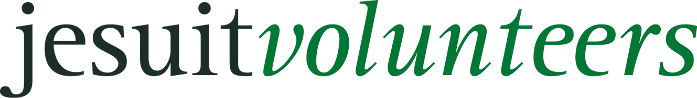

Das Freiwilligenprogramm Jesuit Volunteers ist eine Kooperation von jesuitenweltweit in Deutschland, Österreich und der Schweiz unter der Leitung von jesuitenweltweit in Nürnberg. Jedes Jahr werden Freiwillige jeden Alters in die Welt gesendet, um in sozialen Projekten mitzuarbeiten. Dort teilen sie das Leben der Menschen, begegnen ihnen auf Augenhöhe und lernen ein Jahr lang anders zu leben.

Das Programm basiert auf den Grundsätzen der Jesuiten und ihrer jahrhundertelangen Tradition der Bildungsarbeit und sozialen Gerechtigkeit. Freiwillige werden in verschiedene Länder und Kontinente entsandt, wo sie in lokalen Organisationen und Projekten mitarbeiten, die sich für benachteiligte Menschen einsetzen.

Dieses Jahr werden dreizehn Freiwillige in verschiedene Länder reisen: Peru, Bulgarien, Bosnien-Herzegowina, Griechenland, Indien und Vietnam. Jeder Einsatzort bringt seine eigenen Herausforderungen und Möglichkeiten mit sich, aber alle teilen das gemeinsame Ziel, Menschen in schwierigen Lebenssituationen zu unterstützen und dabei selbst zu lernen und zu wachsen.

### Indien
In Indien sind wir zu dritt – ich werde mit Paulina in Pune leben, während Leo in Kalimpong im Norden Indiens eingesetzt wird.

- Paulinas [Blog](https://paulinainpune.wordpress.com/) [Instagram](https://www.instagram.com/sommernachtsbluetenregentraum/)
- Leos [Blog](http://leoinindien2526.wordpress.com)

### Peru

- Luises [Blog](https://luiseinperu.blogspot.com/) [Instagram](https://www.instagram.com/luiseinperu/)
- Claras [Blog](https://clarainpiura.my.canva.site/)
- Arnes [Blog](https://arnekretzschmar.wixsite.com/my-site-2)

### Bosnien-Herzegowina

- Friedrichs [Blog](https://friedrichinbosnien.wordpress.com/)
- Eva

### Griechenland

- Sinas [Blog](https://sinaathenblog.wordpress.com/) [Instagram](https://www.instagram.com/jv.in.athens/)
- Claus [Blog](https://clausinathen.wordpress.com/) [Instagram](https://www.instagram.com/jv.in.athens/)

### Bulgarien
- Helga & Hans

### Vietnam

- Simons [YouTube-Kanal](https://www.youtube.com/@xXLord_SonimenXx) [Instagram](https://www.instagram.com/xxlord_sonimenxx/)

Die Vorbereitung auf das Freiwilligenjahr beginnt bereits Monate vor der Ausreise. Seit Januar haben wir uns gemeinsam in mehreren Seminaren auf das Jahr vorbereitet. Diese Seminare beschäftigten sich mit Themen wie Kulturbewusstsein in der globalisierten Welt, Krisen- und Notfallmanagement, Armut und Globalisierung sowie Gleichberechtigung. Die Vorbereitungen haben gezeigt, dass die Freiwilligeneinsätze nicht nur persönliche Abenteuer sind, sondern Teil eines größeren Geflechts globaler Verbindungen und Verantwortungen.
Während des Einsatzes werden die Freiwilligen kontinuierlich von jesuitenweltweit begleitet und unterstützt. Regelmäßige Gespräche, Reflexionsmöglichkeiten und der Austausch mit anderen Freiwilligen helfen dabei, die Erfahrungen zu verarbeiten und das Beste aus der Zeit zu machen.
Das Programm versteht sich nicht als Entwicklungshilfe im klassischen Sinne, sondern als Begegnung auf Augenhöhe. Die Freiwilligen sollen lernen, zuhören und verstehen, bevor sie handeln. Sie sollen ihre eigenen Privilegien reflektieren und neue Perspektiven auf globale Zusammenhänge entwickeln.

Nach der Rückkehr werden die Freiwilligen ermutigt, ihre Erfahrungen zu teilen und sich weiterhin für soziale Gerechtigkeit einzusetzen. Viele ehemalige Freiwillige bleiben dem Programm verbunden und unterstützen neue Generationen von Freiwilligen bei ihrer Vorbereitung.

Weitere Informationen zum Freiwilligenprogramm finden Sie unter www.jesuit-volunteers.org.