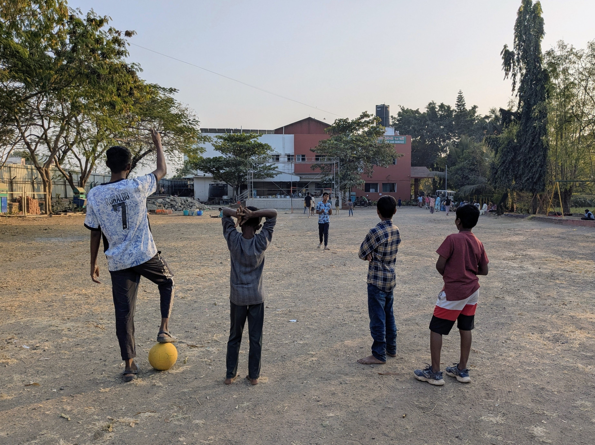
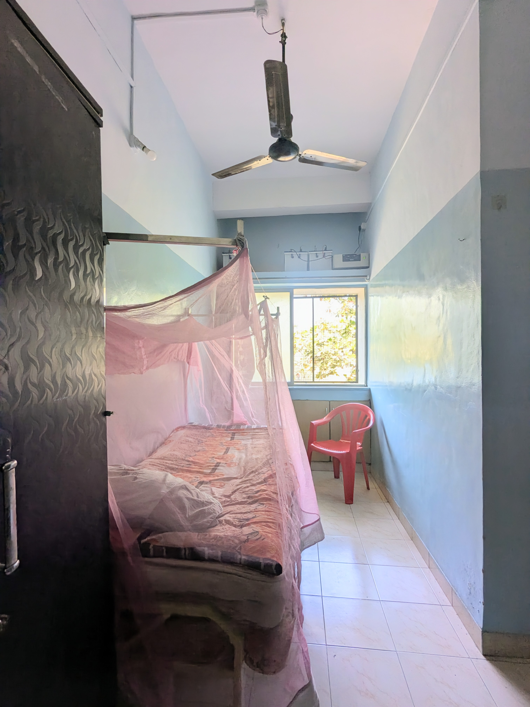
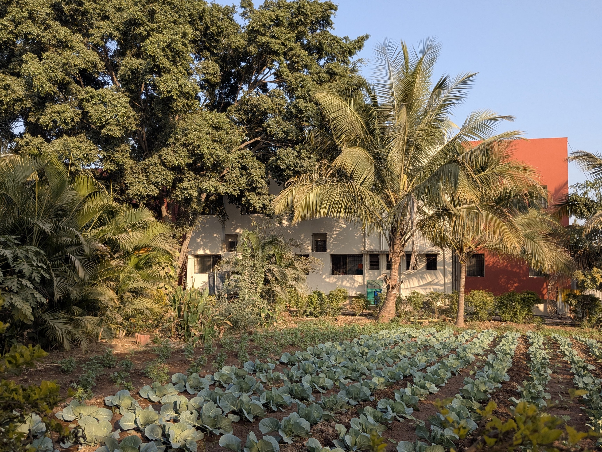
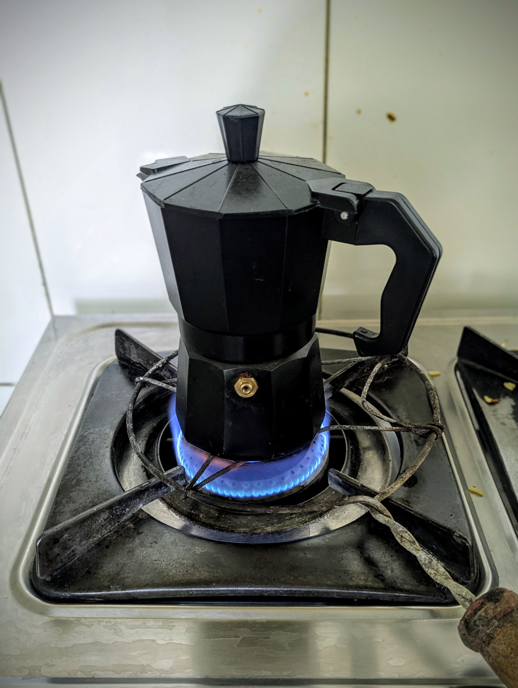
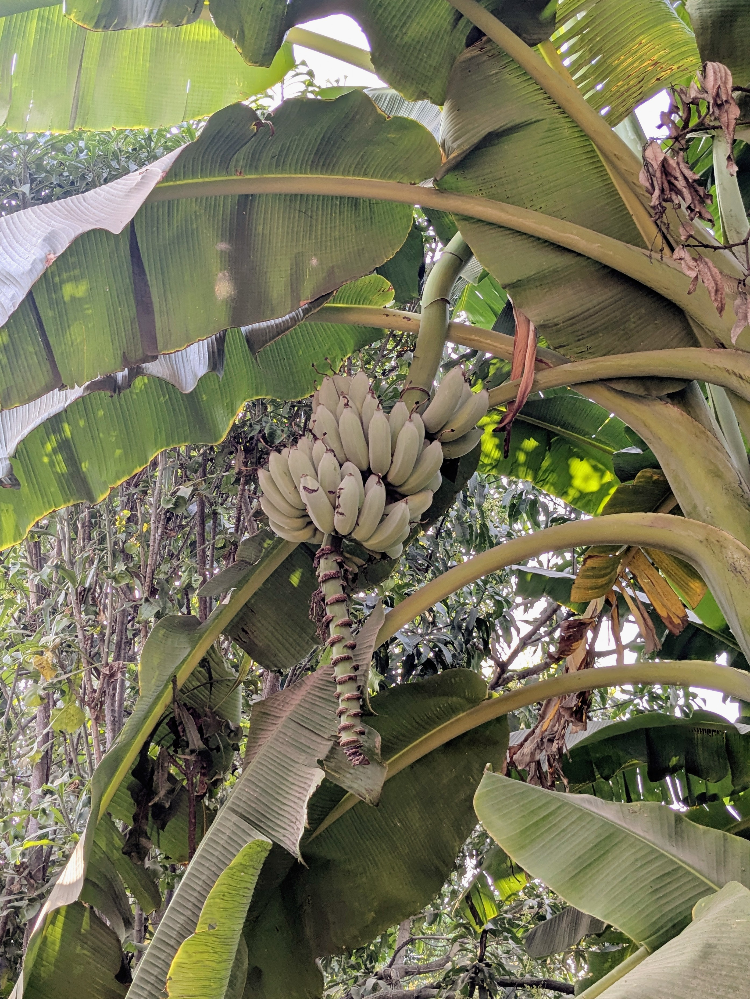
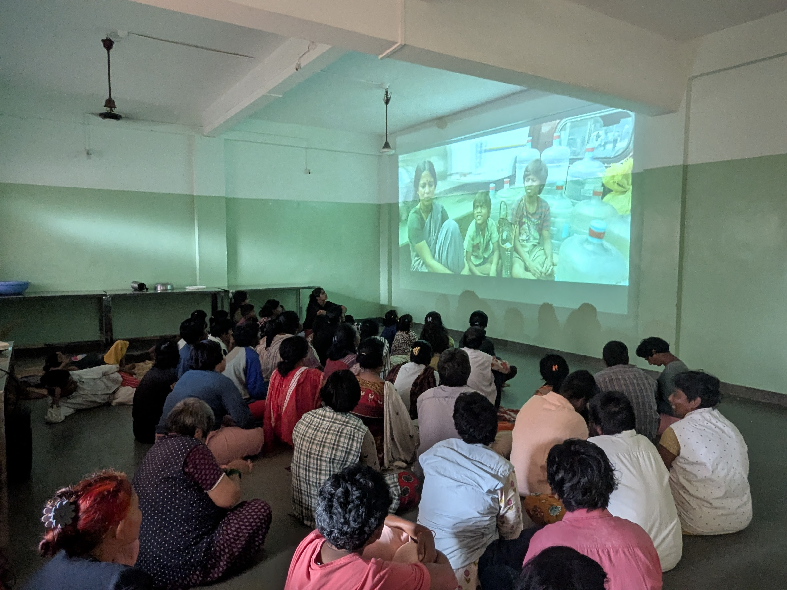
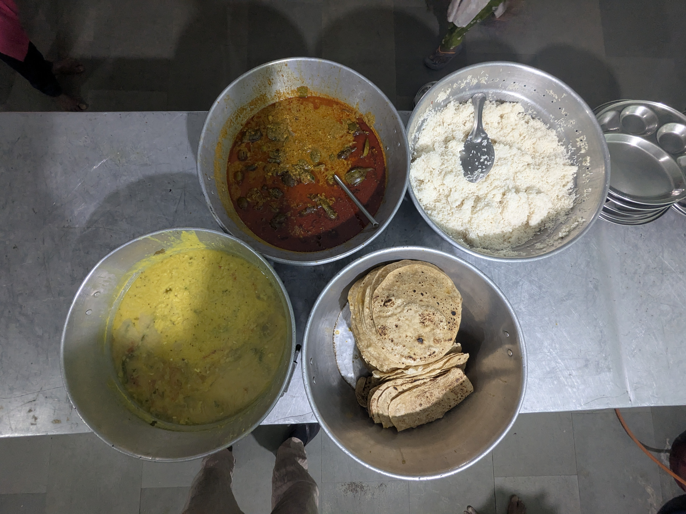
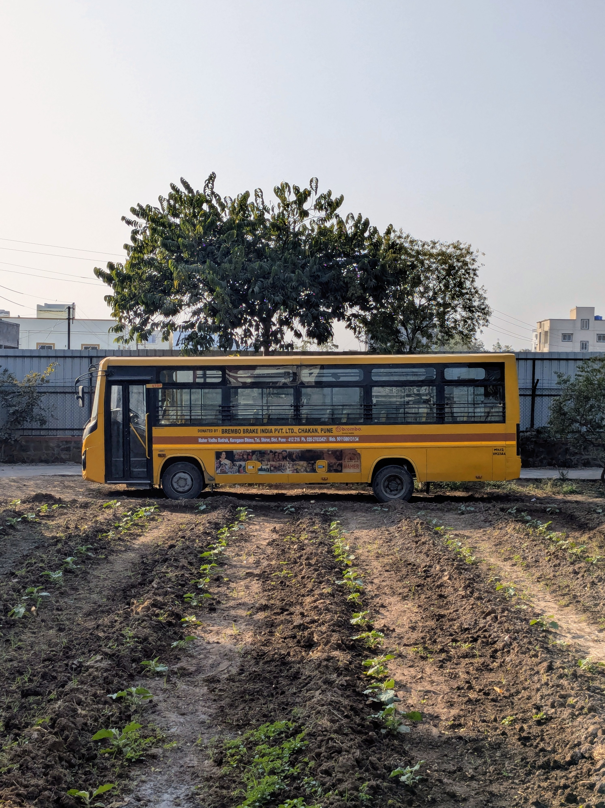

„Kilian Dada! Kilian Dada!" Kleine Fäuste hämmern gegen meine Tür. Ich taste nach meinem Handy. 6 Uhr. Sonntagmorgen. Meine Augen sind halb geschlossen. Vor vier Stunden habe ich mir noch das Bayern-Spiel angeschaut - mitten in der Nacht, dank der viereinhalb Stunden Zeitverschiebung. Gewonnen, natürlich. Ich schwinge die Beine aus dem Bett und öffne die Tür. Fünf kleine Gesichter blicken zu mir hoch. „Football, Dada!" Normalerweise stehe ich erst um neun auf. Aber sonntags gehen die Kinder nicht zur Schule, und das bedeutet: Fußball in der Früh. Ich folge ihnen nach draußen. Das Feld ist staubig. Der letzte Regen liegt Monate zurück, und statt der Schlammspritzer aus der Monsunzeit gibt es jetzt große Staubwolken, die bei jedem Schuss in die Luft steigen. Während der Monsunzeit hat mich das Fußballspielen hier stark an die Spiele in der TSV-Jugend in Berchtesgaden erinnert: Es regnete, es war kalt und matschig, ein echter Kampf. Wenigstens gibt es hier keinen Schneeregen. Und im Gegensatz zu damals geht es hier wirklich einzig und allein um Spaß. Wir spielen eine Stunde, dann zwei. Die Sonne steigt, der Staub legt sich auf unsere Haut. Irgendwann ruft jemand zum Frühstück.

Ich lebe hier. Das vergesse ich manchmal zu erwähnen. Ich wohne nicht in einer WG in der Stadt, fahre nicht morgens zur Arbeit und abends wieder heim. Ich wohne auf meiner Arbeit. Mein Zimmer liegt im Haupthaus von Maher Vatsalyadham, einem der über siebzig Zentren, die Maher in ganz Indien betreibt. Direkt neben mir schlafen jeweils zwischen 30 und 50 beeinträchtigte Frauen und Kinder in den Gruppenzimmern. Wenn ich morgens meine Tür öffne, stehe ich nicht in einem stillen Flur, sondern mitten im Leben: Frauen, die putzen, Kinder, die rennen, Sozialarbeiterinnen, die Anweisungen rufen.

Mein Zimmer ist ungewöhnlich groß für indische Verhältnisse. Eigentlich für zwei Betten ausgelegt, lebe ich als einziger männlicher Freiwilliger alleine hier. Die zwei weiblichen Kolleginnen müssen sich ein Zimmer teilen. Ich habe mehrköpfige Familien gesehen, die auf weniger Platz leben. An meinem Fenster - vergittert, was in mir als Feuerwehrmann jedes Mal einen kleinen Alarm auslöst, denn es gibt nur einen Hauptausgang und einen Weg nach unten aus dem ersten Stock - kann ich auf das Feld hinausschauen, auf dem wir gerade gespielt haben. Aber das ist hier normal. Überall sind die Fenster vergittert. Ein eigenes Bad habe ich auch, sogar mit einer westlichen Toilette, ein Privileg, das ich erst zu schätzen gelernt habe, nachdem ich die Bodentoiletten anderswo gesehen habe.

Der Campus ist eine eigene kleine Welt. Die Mädchen leben im gleichen Haus wie die beeinträchtigten Frauen. Die Jungen hingegen wohnen in einem Haus, so weit wie möglich von den Mädchen entfernt - ich muss den halben Campus überqueren, um zu ihnen zu kommen. Die alten Frauen haben noch einmal ein separates Gebäude auf der anderen Seite. Zwischen den Häusern liegen von Palmen und Bananenstauden gesäumte Wege, ein Kräutergarten und Felder, auf die wir gerade Zwiebeln gepflanzt haben. Einige Mitarbeiter leben hier mit ihren Familien in Einzimmerwohnungen, die sich an den Rand des Geländes schmiegen. Wenn ich etwas brauche, kann ich in die Stadt fahren und dort eine Mall oder einen Supermarkt finden. Für Kleinigkeiten - Süßigkeiten, eine Cola, einen Haarschnitt für einen Euro - reicht es, das Tor zu verlassen und einen der zahlreichen kleinen Shops an der Straße aufzusuchen. Der ganze Komplex ist von einem Zaun umzäunt - nachts um acht wird das Tor abgeschlossen, und wenn ich später zurückkomme, muss ich entweder über den Zaun klettern oder durch das Zimmer der Mädchen schlüpfen, die als einzige eine Außentür haben.

Seit Monaten hat es nicht mehr geregnet, und die Natur wird staubiger, trockener. Im Verkehr draußen braucht man mittlerweile Kopftücher, um den Staub abzuhalten. Aber innerhalb des Zauns ist es noch grün genug: Die Palmen halten sich, die Bananenpflanzen tragen Früchte, der Garten wird täglich gegossen.

Bevor ich frühstücke, brauche ich Kaffee. Ich gehe zur Küche, einem separaten Gebäude neben dem Essensraum. Die Köchinnen sind schon da, rühren in großen Töpfen, schneiden Gemüse. Ich zünde die Flamme mit einem Streichholz an und stelle meine italienischen Espressokocher auf den Gasherd - bestellt über Amazon.in, ein Luxus, den ich mir nach über fünf Monaten gegönnt habe. Das Wasser kocht, der Kaffee blubbert nach oben. Der Geruch füllt die Küche. Eine der Köchinnen lächelt, sagt etwas auf Marathi. Ich verstehe nicht, aber ich lächle zurück.

:::gallery

:::

Bevor das Essen ausgegeben wird, gibt es ein Gebet. Die Patientinnen und Kinder stellen sich in Reihen auf, manche sitzen bereits auf dem Boden, andere an den wenigen Tischen. Eine Sozialarbeiterin beginnt zu sprechen, ihre Stimme rhythmisch, vertraut. Die Antworten kommen im Chor. Ich verstehe kein Wort Marathi, aber nach fünf Monaten kenne ich den Rhythmus. Wann alle gemeinsam sprechen, wann die Pause kommt, wann das Ende naht.
Dann beginnt die Ausgabe. Vor mir stehen große Töpfe: Chapati - flache, runde Fladenbrote aus Vollkornmehl, die zu jeder Mahlzeit auf den Teller kommen. Dreimal am Tag, sieben Tage die Woche, seit über fünf Monaten. Ich kann sie nicht mehr sehen. Daneben eine orangebraune, leicht ölige Soße, scharf und würzig. Ein Topf mit Poha, einem Reisgericht mit Zwiebeln und Gewürzen. Hartgekochte Eier. Chai, gezuckerter schwarzer Tee mit Milch, dampft in einem großen Kessel.
Die erste Frau schiebt mir ihr Metallgeschirr entgegen. Ich lege zwei Chapati darauf - sie fühlen sich trocken und leicht fettig an, noch warm -, schöpfe die Soße darüber, das Metall klappert unter dem Aufprall der Kelle. Ein Ei. Sie nickt mir zu, unsere Blicke treffen sich für einen Moment. Dann die nächste. Und die nächste. Verlässliche Patientinnen helfen mit, tragen die befüllten Teller zu denen, die nicht mehr selbst gehen können.

Vormittags gehe ich manchmal in die Produktion. Nicht immer, oft gibt es anderes zu tun. Aber wenn ich gehe, setze ich mich an einen großen Tisch, stecke meine Kopfhörer ein und mache Ohrringe. Kleine Metallringe, die ich durch andere Metallringe fädele, immer und immer wieder.
Am Anfang waren meine Hände langsam, ungeübt. Die Frauen und Mitarbeiterinnen neben mir schafften das Dreifache in der gleichen Zeit. Aber mittlerweile, nach fünf Monaten, hat sich das geändert. Meine Finger bewegen sich schnell, routiniert, präzise. Ich bin der Schnellste geworden. So schnell, dass ich mittlerweile der Einzige bin, der noch Ohrringe machen darf. Die anderen haben sich anderen Aufgaben zugewandt: Ketten, Taschen, Tee abpacken. Ich sitze da, Podcast in den Ohren, und fädele Ring um Ring. Die Arbeit ist monoton, nicht besonders fordernd. Aber manchmal ist es genau das, was ich brauche: Hände beschäftigt, Kopf woanders.

Nach der Produktion, noch am Vormittag, beginnt die eigentliche Herausforderung: die Activities mit den beeinträchtigten Frauen. Ich gehe zum Lagerraum, wo die Spielsachen hinter einem Vorhängeschloss aufbewahrt werden. Eine der Mitarbeiterinnen hat den Schlüssel. Ich frage, gestikuliere, deute auf Bälle. Sie verschränkt die Arme, sagt etwas auf Marathi. Ich verstehe nicht. Schließlich gibt sie nach, schließt auf, ich nehme die Bälle und einen Eimer.
Die Frauen sitzen bereits im Kreis. Manche schauen mich an, große Augen, erwartungsvoll. Andere starren ins Leere. Eine schläft im Sitzen. Ich beginne, den Ball zu werfen, zeige, dass sie ihn in den Eimer werfen sollen. Eine wirft - verfehlt. Eine andere fängt den Ball, lässt ihn fallen, Speichel tropft aus ihrem Mund. Ein scharfer, durchdringender Geruch liegt im Raum - nach abgestandener Luft, nach Körpern, nach zu wenig Lüften. Ich versuche, durch Gesten zu erklären, durch Mimik, durch Wiederholung. Eine indische Sozialarbeiterin kommt hinzu, übersetzt, hilft. Manche Frauen machen mit, manche nicht. Eine weitere ist eingeschlafen.
An anderen Tagen läuft Musik. Die jungen Mädchen, die nicht mehr zur Schule gehen, wollen alle verschiedene Songs hören. Ich brauche ein Handy mit indischer Spracherkennung, weil sie nicht auf Englisch tippen können. Eine drückt auf Pause, weil ihr das Lied nicht gefällt. Eine andere will das nächste. Ich schalte die Musik aus, hole tief Luft, schalte sie wieder ein. Über dreißig Frauen, eine Sprache, die ich nicht spreche, und ein Vorhängeschloss, hinter dem die Spielsachen weggesperrt sind. Manchmal frage ich mich, was ich hier eigentlich tue.

Mittags gebe ich wieder Essen aus. Chapati. Dal - ein Linsengericht, das es zu jeder Mittags- und Abendmahlzeit gibt. Reis. Warmes Gemüse in scharfer Soße - Kohl, Aubergine, Bohnen, immer mit viel Koriander. Fast nie Fleisch, in fünf Monaten vielleicht zweimal. Das Essen ist deutlich schärfer als in Deutschland. Am Anfang eine Herausforderung, mittlerweile esse ich immer schärfer, die Zunge hat sich angepasst. Einmal hatte ich eine Lebensmittelvergiftung, ansonsten läuft der Magen erstaunlich stabil. Dazu frisches Obst, je nach Saison: Bananen, Mangos, Erdbeeren, Papaya, Drachenfrucht, Orangen, Feigen, Granatäpfel, Wassermelonen, Passionsfrucht.
Doch dann ein Rascheln in der Ecke. Eine dunkle Gestalt huscht über den Boden. Der Schwanz einer Ratte, deutlich sichtbar. Sie verschwindet unter einem Tisch. Ich schaue auf. Die anderen reden, lachen. Ich esse weiter. Ein weiteres Rascheln. Die Ratte ist einfach Teil des Abendessens. Wie bei uns eine Fliege. Auf den Straßen wühlen wilde Schweine, Hunde, Ziegen und Kühe im Müll. Niemand kümmert sich darum. Ratten im Essensraum interessieren die Inder genauso wenig.

Nachmittags wird es leichter. Die Kinder - acht bis zwölf Jahre alt - schauen mich mit leuchtenden Augen an, wenn ich „Ninja!" rufe. Sie verstehen das Spiel, das ich ihnen beigebracht habe, sofort, rennen los, lachen, selbst die Schüchternen machen mit. Oder die kleinen Kinder, die mich mit großen Augen anschauen, meine Hand nehmen, mit mir über den Campus spazieren wollen. Die Sprache spielt dann keine Rolle. Wir spielen Fangen, werfen Bälle, laufen einfach nur herum. In ihren Gesichtern sehe ich echte Freude. Keine Worte nötig.
Mit den ganz kleinen Kindern komme ich am einfachsten zurecht. Sie nennen mich „Kilian Dada" - das heißt Bruder - oder einfach „Brother". Bei ihnen muss ich nicht erklären, nicht übersetzen, nicht raten, was sie brauchen. Sie wollen nur hochgehoben werden, wollen schaukeln, wollen auf den Spielgeräten herumklettern. Das ist der Teil meiner Arbeit, den ich am meisten liebe. Später helfe ich bei den Hausaufgaben. Ich kann nur in Mathe, Englisch und Science helfen - alles andere ist auf Marathi. Mathe ist auch hier ein schwieriges Fach, manche Dinge überschreiten Kulturen.

Unter den Kindern selbst gibt es eine strenge Hierarchie: Wer älter ist, bestimmt. Wer älter ist, schläft im Bett, die Jüngeren auf dem Boden. Auch die Mitarbeiter arbeiten hierarchisch. In Deutschland sind wir flache Hierarchien gewöhnt. Entscheidungen werden geteilt, Kommunikation ist direkt. Hier ist die Machtdistanz hoch. Entscheidungen fallen von oben nach unten. Untergebene respektieren Autoritäten, oft ohne Widerspruch. Familie und Alter bestimmen die Rangordnung. Ältere werden bedingungslos respektiert. Ich suche meinen Platz in diesem System. Bin ich hier als Mann zu sehen? Als Student? Als europäischer Gast? Alle drei gleichzeitig? Wo gehöre ich hin? Ich weiß es nach fünf Monaten immer noch nicht genau.

Abends teile ich wieder aus. Wieder Chapati. Wieder Dal. Wieder Reis. Wieder Gebet. Der Kreislauf schließt sich. Ein Tag bei Maher - mein Alltag. Zwischen Chapati, die ich nicht mehr sehen kann, und Hierarchien, die ich noch nicht ganz verstehe. Ich lebe zwischen zwei Welten, in denen das Gewöhnliche außergewöhnlich ist und das Außergewöhnliche ganz gewöhnlich. Ratten im Esssaal? Normal. Espresso auf Bestellung? Luxus.

Ich wohne auf meiner Arbeit. Das bedeutet: Ich kann nicht nach Hause gehen, wenn der Tag zu viel wird. Aber es bedeutet auch: Ich bin immer da, wenn um sechs morgens kleine Fäuste gegen meine Tür hämmern und „Kilian Dada!" rufen. Und meistens - nicht immer, aber meistens - ist das genau richtig.

