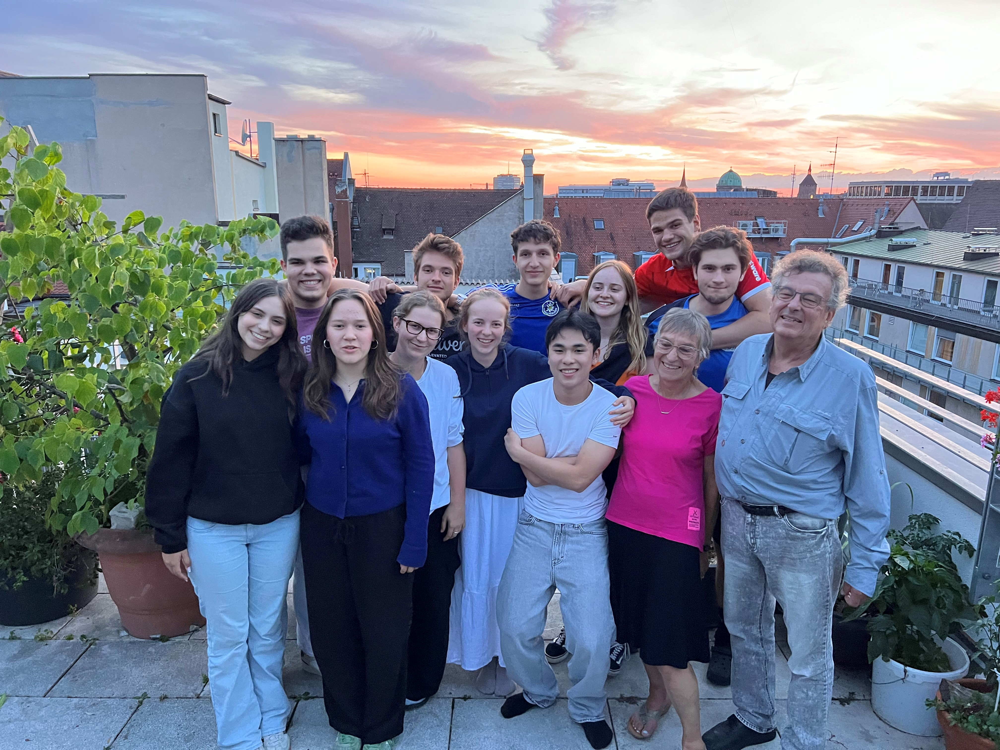

Der Koffer ist gepackt, die Flugtickets gebucht, der Abschied naht. In wenigen Tagen beginnt meine Reise nach Pune, Indien – ein Jahr, das mich vermutlich mehr verändern wird als alle achtzehn Jahre zuvor. Während ich diese Zeilen schreibe, schwanke ich zwischen Vorfreude und einer Art ehrfürchtiger Ungewissheit.
Eigentlich wäre nach dem Abitur alles klar gewesen: Studium, Karriere, meine Vorstellung vom planbaren Leben. Doch dann kamen die Zweifel. Was, wenn ich mich in etwas verrenne? Was, wenn ich jahrelang im falschen Zug sitze, bevor mich die Realität unsanft zurückholt? Und vor allem: Wann würde ich je wieder die Chance haben, ein ganzes Jahr meines Lebens einer völlig anderen Welt zu widmen? Die Antwort war ernüchternd: wahrscheinlich nie.
Ich bin Kilian Kienast und stehe vor dem vermutlich verrücktesten Jahr meines bisherigen Lebens.

Während meine Mitschüler ihre Ausbildungs- und Studienplätze antreten, muss mein Studium also noch warten. Nicht, weil ich die Welt retten will – das wäre größenwahnsinnig –, sondern weil ich ahne, dass sie mich retten könnte.

Hunger in einer Welt des Überflusses, Klimawandel trotz besseren Wissens, wachsende Ungleichheit -  die Gegensätze unserer Welt bewegen mich. Besonders geprägt haben mich dabei meine Eltern, aber auch meine Zeit in der Kolpingsfamilie Berchtesgaden und mein Engagement bei Fridays For Future. All das hat mich immer öfter an dem zweifeln lassen, was wir in Deutschland für erstrebenswert halten: der glänzende SUV in der Einfahrt, die jährliche Flugreise ans andere Ende der Welt, das perfekte Outfit im Kleiderschrank - unser sogenannter „Wohlstand”. Doch was kostet dieser Wohlstand? Nicht in Euro, sondern in menschlichen Schicksalen, in Umweltzerstörung, in globaler Ungerechtigkeit. Ist er das wert? Und ist das wirklich alles? Ich bin mir da nicht so sicher und so beschäftigen mich diese Fragen schon seit meiner Kindheit, die ich neben der Schule auch bei der Freiwilligen Feuerwehr, als Ministrant und bei den Fußballmannschaften des TSV Berchtesgaden verbringen durfte.
Des Weiteren führe ich gerne tiefe Gespräche, bin wissbegierig bis zur Besessenheit – was sich in meinen *Jugend forscht*-Projekten zuspitzte – und verbringe meine Zeit gerne mit meiner Familie und Freunden.

Mit dem Freiwilligenprogramm *Jesuit Volunteers* werde ich bei *Maher* arbeiten, was *Haus der Mutter* in der lokalen Sprache Marathi bedeutet. Die Organisation kümmert sich um vernachlässigte Kinder sowie psychisch kranke Frauen und Männer. Ich werde Kinder bei den Schulvorbereitungen unterstützen, Angebote für Frauen begleiten und meine Kenntnisse in Englisch, Deutsch und IT weitergeben. Jedenfalls ist das der aktuelle Stand mehr dazu dann aus Indien.
Jesuit Volunteers ist eine Kooperation von jesuitenweltweit in Deutschland, Österreich und der Schweiz. Jedes Jahr werden Freiwillige jeden Alters in die Welt gesendet, um in sozialen Projekten mitzuarbeiten. Dort teilen sie das Leben der Menschen, begegnen ihnen auf Augenhöhe und lernen ein Jahr lang anders zu leben. Dieses Jahr werden wir dreizehn Freiwillige sein, die sich auf sechs Länder verteilen: Peru, Bulgarien, Bosnien-Herzegowina, Griechenland, Indien und Vietnam. Unterschiedliche Hintergründe, unterschiedliche Alter – von achtzehn bis nahe achtzig und uns eint der wahrscheinlich naive, sicher idealistische, aber doch notwendig optimistische Traum von „mehr Gerechtigkeit”.

Die Zuteilung der Länder erfolgte dabei nach dem Sendungsprinzip: man bewirbt sich auf das Programm, nicht auf konkrete Orte, wobei man aber Wünsche äußern darf. Ich hatte den Wunsch, in eine mir gänzlich unbekannte Kultur in einer warmen Region zu gelangen und gab Indien als Wunschziel an, wo ich glücklicherweise nun auch landen werde. In Pune sind wir zu zweit – ich werde mit [Paulina](https://paulinainpune.wordpress.com/), einer weiteren Freiwilligen, leben.

Seit Februar haben wir uns vorbereitet. In Seminaren zu Globalisierung, Gerechtigkeit, Armut und kulturbewusster Kommunikation sollte uns ein Bewusstsein für unsere in der Welt einmaligen Privilegien vermittelt werden. Wussten Sie, dass am Kilimandscharo Kleinbauern nur zu bestimmten Uhrzeiten Wasser bekommen, weil in der übrigen Zeit das Wasser für Rosenfelder benötigt wird? Rosen, die hauptsächlich wir importieren. Oder haben Sie jemals eine *Peters-Projektion* der Weltkarte gesehen, eine flächentreue Darstellung, bei der Europa plötzlich klein und unbedeutend am oberen Rand hängt, während Afrika das Zentrum einnimmt – ein einfacher Perspektivwechsel, der zeigt, wie sehr unsere Sicht auf die Welt von der Anordnung auf einem Stück Papier geprägt ist.

Die Experimente blieben mir dabei besonders im Gedächtnis: Wir simulierten ein Abendessen nach weltweiten Lebensstandards. Dreigänge-Menü mit Champagner für die wenigen Reichen, Nudeln mit Pesto für die Mittelschicht, Weißbrot mit Wasser für die Mehrheit der Weltbevölkerung. Ich landete in der Gruppe des Globalen Südens. Ironisch genug: Selbst unser simuliertes Elend war noch Luxus verglichen mit der Realität, die Milliarden Menschen täglich erleben. In einem weiteren Versuch hatten wir die Aufgabe uns in der Nürnberger Innenstadt unser Mittagessen zu erbetteln - eine Aufgabe, die mich an die Grenzen meines Schamgefühls geführt hat, von denen ich nicht einmal wusste, dass sie existieren.

Anfang Juli wurden wir schließlich in Nürnberg ausgesandt. Mit Gottes Segen, wie es hieß. Ob Gott nun segnet oder nicht – was ich weiß: Ich reise nicht als Retter nach Indien. Ich bin kein Held, kein Weltverbesserer, kein moderner Missionar. Ich bin ein junger Mann, der ahnt, dass er mehr Fragen als Antworten hat. Und vielleicht ist das der Grund, warum ich nach Indien reise: um die richtigen Fragen zu finden.

Ab August werde ich monatlich berichten – im Berchtesgadener Anzeiger und hier auf meinem Blog. Nicht, weil ich bereits weiß, was ich erzählen werde, sondern gerade weil ich es nicht weiß. Nehmen Sie Teil an einer Reise, deren Ziel unbekannt ist. Vielleicht entdecken wir gemeinsam, dass die Welt komplizierter und einfacher ist, als wir dachten.
Ich würde mich sehr freuen, wenn Sie mich auf meinem Weg begleiten – sei es durch Ihr Interesse, Ihre Gedanken, Ihre Rückmeldung oder auch durch eine Spende für mein Projekt. Jede Form der Unterstützung hilft mir und vor allem den Menschen vor Ort.