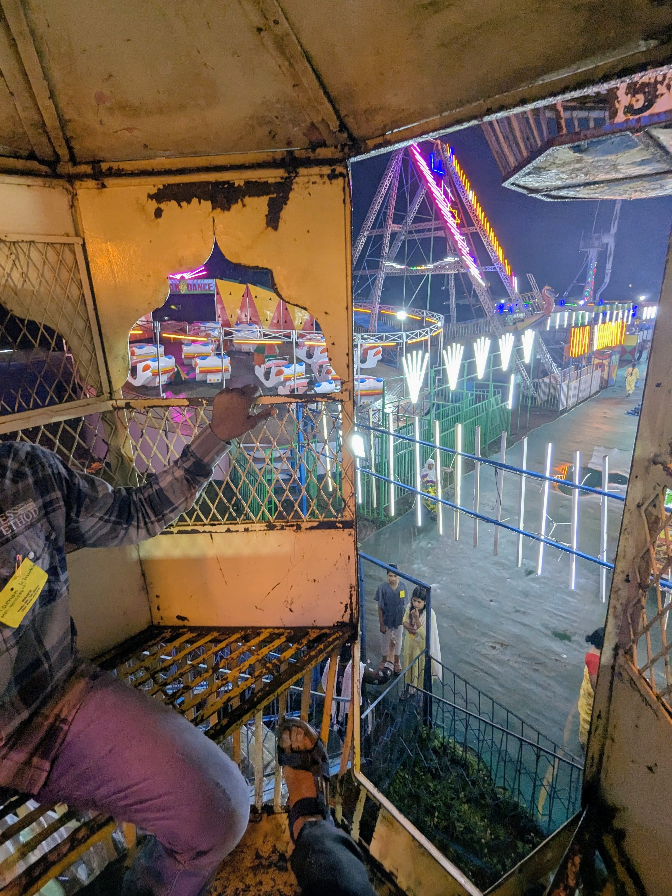
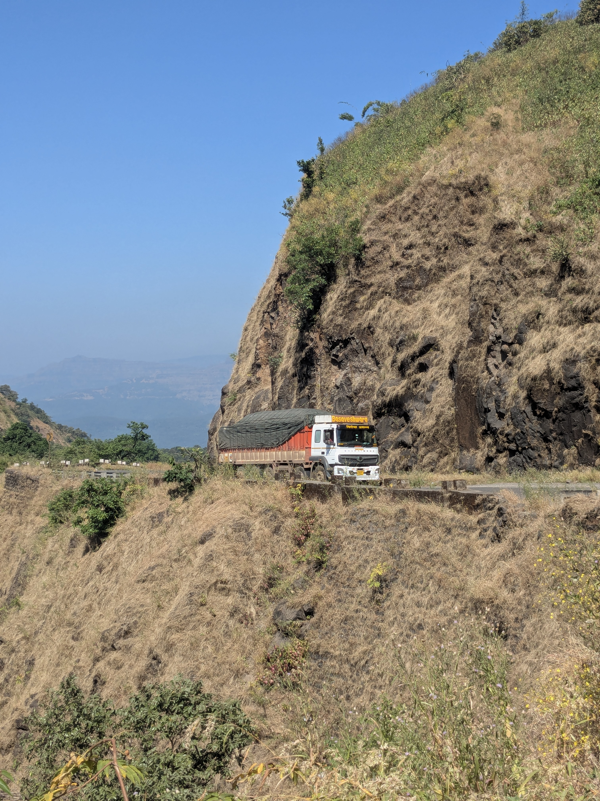
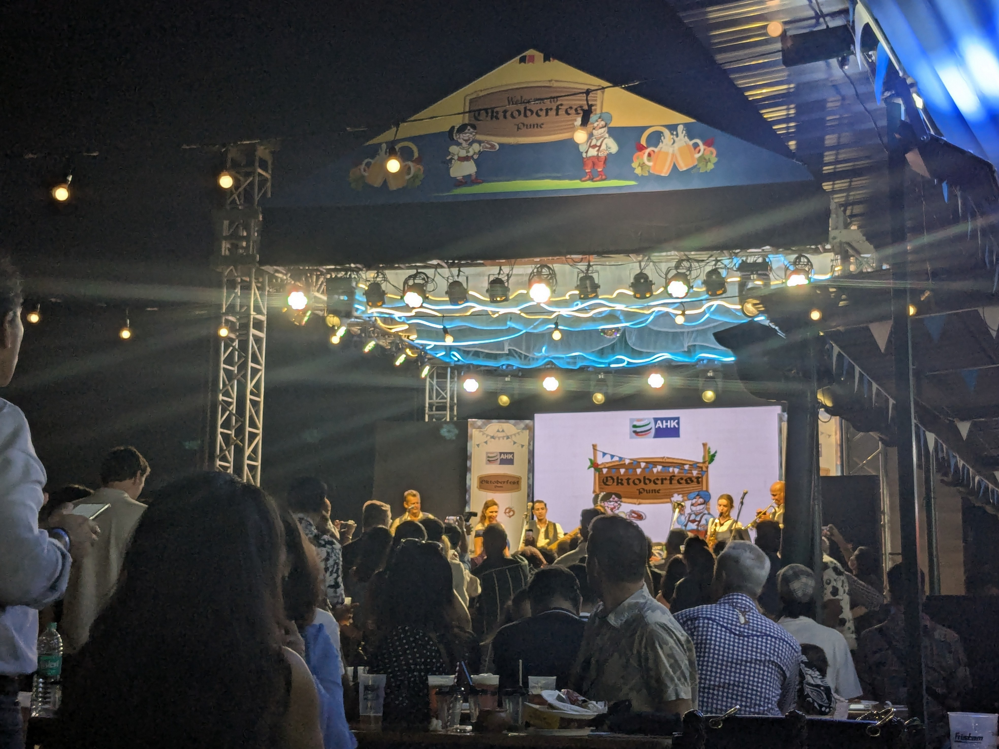
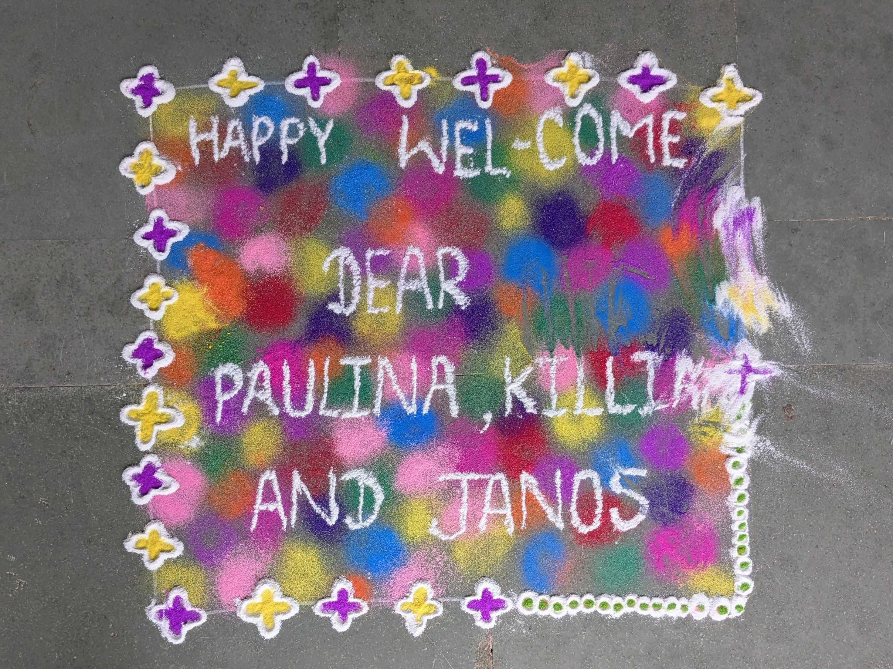
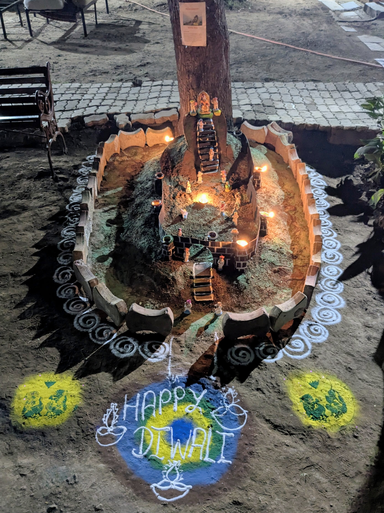
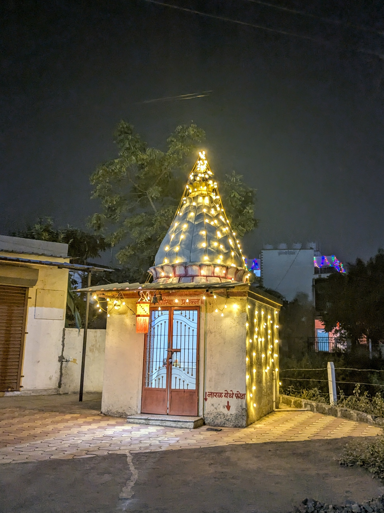
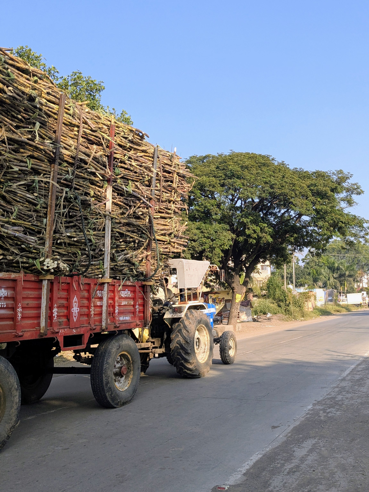
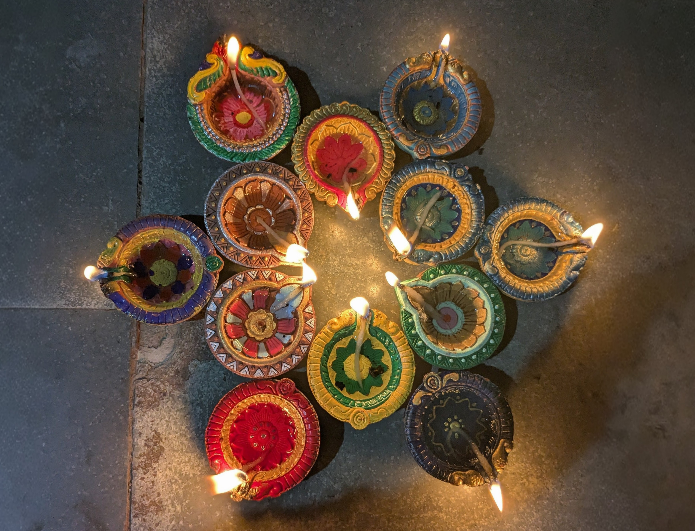
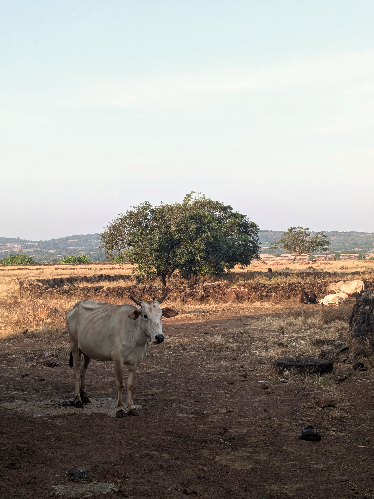
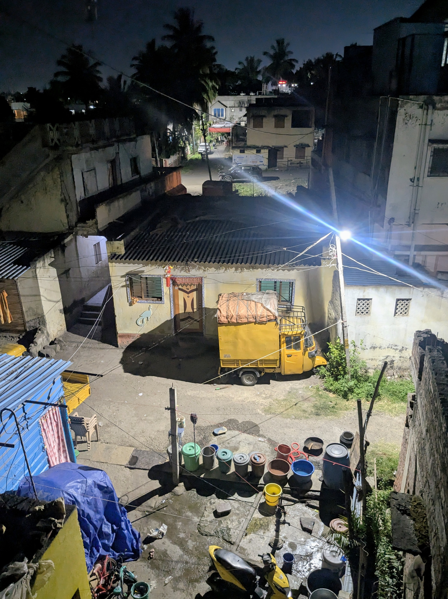

Meine Hände umklammern eine rostige Metallstange. Das einzige, was zwischen mir und einem fünfzehn Meter tiefen Fall steht. Die Gondel hat keine Tür. Nur eine offene Luke, durch die ich die anderen Fahrgeschäfte sehen kann: eine Schiffsschaukel, bei der die Sicherheitsbügel nicht schließen, Boote auf kreisenden Schienen, Kinder schreien, Musik dröhnt, alles übersteuert. Der Geruch von Benzin liegt in der Luft, scharf und penetrant. 

Irgendwo unter uns röhrt ein Motor, unregelmäßig, stotternd. Ein Mann in einem verschlissenen Hemd sitzt auf einem wackeligen Metallstuhl neben einem Generator. In der einen Hand hält er einen angeschweißten Metallhebel, in der anderen eine Schnur, die direkt in den Motor führt. Er zieht an der Schnur. Einmal, zweimal. Der Motor hustet. Spuckt. Springt an. Ein plötzlicher Ruck. Mein Magen sinkt. Die Gondel schießt nach vorne, das Riesenrad beginnt sich zu drehen. Meine Gondel ruckt nach oben. Rost rieselt auf meine Hände. Der Mann drückt den Hebel, gibt Gas. Wir drehen uns schneller. Und noch schneller. Die Kinder neben mir kreischen vor Vergnügen. Ich halte die Stange fester. Zentimeter neben uns schwingt eine andere Gondel vorbei, so nah, dass ich die Angst in den Augen der anderen Passagiere sehen kann. Unter uns drückt der Mann rhythmisch den Hebel. Gas. Mehr Gas. Es gibt keinen Notausschalter. Keinen Sicherheitsgurt. Keine TÜV-Plakette. Das ist Wahnsinn. Das ist Indien. 
Das Riesenrad stoppt. Aber das Drehen hört nie auf. Vier Monate in Indien, und ich drehe mich immer noch – nur mittlerweile nicht mehr auf verrosteten Riesenrädern, sondern in einem Karussell aus kulturellen Missverständnissen, unverhofften Begegnungen und der ständigen Frage: Was bedeutet das eigentlich gerade?

Je länger ich hier bin, desto klarer wird mir: Nicht Indien ist seltsam – ich bin es. Meine deutsche Brille verzerrt ständig, was ich sehe. Etwa die Sache mit den Händen. Wenn man sich hier begrüßt, schüttelt man sich die Hand – und dann lässt man sie einfach nicht mehr los. Neulich zum Beispiel: Ramesh, einer der Sozialarbeiter, begrüßt mich nach dem Frühstück. Wir schütteln uns die Hände – und er lässt nicht los. Einfach nicht. Fünf Minuten später laufen wir haben über das Gelände, Hand in Hand, während er mir von den Renovierungsplänen erzählt. Das war das erste Mal. Mittlerweile bin ich daran gewöhnt. Männer gehen hier oft Hand in Hand spazieren, halten sich bei Gesprächen weiter an den Händen, ziehen einander an der Hand mit sich. Für mich als Deutschen eine Umgewöhnung, die immer noch manchmal zu verwirrten Momenten führt, wenn mich jemand minutenlang nicht mehr loslässt.

Dann das Kopfnicken. Oder besser: das Kopfwackeln. Wenn ich jemanden etwas frage und die Person den Kopf von links nach rechts bewegt – meint sie ja oder nein? Die Antwort: Ja. Wahrscheinlich. Meistens. Das indische Nicken ist ein sanftes Pendeln von links nach rechts, kein entschiedenes Auf und Ab wie bei uns. In den ersten Wochen habe ich ständig nachfragen müssen, weil ich nie wusste, ob wir uns gerade einig sind oder das komplette Gegenteil ausgemacht haben. Mittlerweile erkenne ich die Nuancen – ein schnelleres Wackeln bedeutet enthusiastische Zustimmung, ein langsames ist eher ein "vielleicht". Oder doch nicht. Ich bin mir nie ganz sicher.
Noch verwirrender: die Zahlen. In Indien zählt man nicht in Hunderttausenden oder Millionen, sondern in Lakh und Crore. Ein Lakh sind 100.000, ein Crore sind 10 Millionen. Und wenn man die Zahlen aufschreibt, werden sie nicht wie bei uns in Dreiergruppen getrennt, sondern erst drei, dann immer zwei: 10,00,00,000. Das sind hundert Millionen. Am Anfang klang alles nach unvorstellbaren Summen, bis ich merkte, dass die Nullen nur anders angeordnet sind.

Das größte Missverständnis aber ist die Sache mit den Stühlen: Egal wo ich hinkomme, mir wird ein Stuhl angeboten. Immer. Alle anderen sitzen am Boden – auf Matten, auf Teppichen, auf dem nackten Beton – und mir wird ein Plastikstuhl hingestellt. Wie ein kleiner Thron. Am Anfang dachte ich, das sei Hierarchie, ein Machtgefälle. In meinem Kopf saß das Bild fest: Alle anderen auf dem Boden, ich alleine erhöht – das ist falsch, das will ich nicht. Also lehnte ich höflich ab und setzte mich demonstrativ auf den Boden. Was ich für Respekt hielt, war für die Inder bestenfalls verwirrend. Sie bestanden darauf. „No, no, you are the guest. Please sit." Ich blieb stur. Das Ergebnis: Ich saß verkrampft auf dem harten Steinboden, während alle anderen entspannt und bequem neben mir Platz nahmen – und irgendwer drückte mir trotzdem noch ein Kissen in die Hand. Es hat lange gedauert, bis ich verstanden habe: Für uns Deutsche ist das Sitzen am Boden mit Hierarchie verbunden. Wer am Boden sitzt, hat weniger. Hier in Indien ist das nicht so. Am Boden zu sitzen ist normal, oft sogar religiös bevorzugt. Es hat keine Bedeutung, ob man auf dem Stuhl oder am Boden sitzt – außer vielleicht, dass Gäste traditionell besonders behandelt werden. Mittlerweile habe ich aufgehört, dagegen zu argumentieren. Wenn sie mir einen Stuhl anbieten, setze ich mich hin. Auch wenn ich mich immer noch ein bisschen komisch dabei fühle, als einziger erhöht auf dem Stuhl zu sein, während alle anderen auf dem Boden sitzen.

Nicht weniger bizarr: das Kino. Bevor der Film beginnt, müssen alle aufstehen. Die Nationalhymne erklingt. Jeder steht, Hand aufs Herz, singt mit. Nach einer Minute ist es vorbei, alle setzen sich, der Film startet. Zwei Stunden lang dann: kompletter Fiebertraum. Verhexte Wesen, brutale Kämpfe, Köpfe rollen, Blut spritzt. Aber sobald jemand eine Zigarette anzündet oder eine Flasche Alkohol ins Bild kommt – Unschärfe. Die Zigarette wird verpixelt, die Flasche verschwommen, und am unteren Bildrand erscheint ein Warnhinweis: "Rauchen ist gesundheitsschädlich." Gewalt, Blut, Verstümmelung – alles kein Problem. Aber eine Zigarette muss zensiert werden. Zur Halbzeit dann eine kurze Unterbrechung: Ein Anti-Raucher-Spot läuft, mit ekligen Bildern von Operationen und schwarzen Lungen. Dann geht es weiter mit der nächsten Schlägerei. Ich sitze da mit Decke, Pulli und Socken, weil indische Kinos auf Polartemperaturen heruntergekühlt werden, und frage mich, in welchem Paralleluniversum ich gelandet bin.

Davor hatte ich eine Begegnung der besonderen Art. Wir waren unterwegs, ich mit einer Cola in der Hand, als plötzlich ein Affe kreischend auf mich zugerannt kam. Bevor ich reagieren konnte, bedeutete mir ein Mann: „Gib ihm die Cola." Ich schaute ihn verständnislos an. Er wackelte mit dem Kopf. Ich reichte die Flasche. Der Affe nahm sie, schraubte den Deckel auf, setzte die Flasche an und trank. Als wäre es das Normalste der Welt. „Die Affen hier trinken nur Cola", erklärte der Mann. „Kein Wasser."
Der Höhepunkt der kulturellen Absurdität aber war das Oktoberfest in Pune. Ja, es gibt ein Oktoberfest in Pune. Wir fuhren hin – typisch deutsch – pünktlich zur offiziellen Eröffnung um zwölf Uhr mittags, als die Inder gerade erst anfingen aufzubauen. Eine Breze kostete zwei Euro – für indische Verhältnisse ein Vermögen, für deutsche Gaumen eine Enttäuschung. Sie schmeckte wie eine zwei Tage alte tschechische Aufbackbreze aus dem Discounter. Aber irgendwie fühlte ich mich durch den überhöhten Preis gleich ein bisschen wie zuhause. Später kam eine deutsche Band auf die Bühne und ich fand eine deutsche Familie, die Schafkopfen spielte. Schafkopfen! In Pune! Ich setzte mich dazu, spielte ein paar Runden, und zum ersten Mal seit Monaten fühlte sich etwas vertraut an.

So anders hier alles ist, eines bleibt immer gleich: die Gastfreundschaft. Ich bin mittlerweile mehrfach auf der Straße von Fremden angesprochen und nach Hause zum Essen eingeladen worden. Einfach so. Einmal bin ich durch das Nachbardorf gelaufen, ein Junge spricht mich an, fragt, woher ich komme, was ich hier mache – und zehn Minuten später sitze ich in seinem Haus, seine Mutter serviert Reis mit Dal, wir trinken Chai, schauen nebenbei Cartoons im Fernsehen. Die Familie ist überglücklich, dass ich mitgekommen bin. Als ich gehe, drücken sie mir Süßigkeiten in die Hand, für später.
Selbst bei Maher, der Organisation, für die ich arbeite, werde ich auch nach vier Monaten noch mehrmals täglich gefragt, ob ich schon gegessen habe. Oft ohne Worte: Eine Handbewegung, die offene Handfläche zum Mund geführt, fragender Blick. „Gegessen?" Ich nicke. Sie nicken zurück. Alles gut. Danke. Und trotzdem fragen sie weiter, jeden Tag, als müssten sie sich jedes Mal neu versichern.

Die Kinder sind besonders interessiert. Sie laufen auf mich zu, fragen: "Ronaldo or Messi?" Ich sage Messi. Große Diskussion. Die Hälfte ist für Ronaldo. Wir reden über Fußball, über Marvel-Filme, die hier jeder kennt, über Handymarken. Sie zeigen mir ihre Lieblingsfilme auf YouTube, Bollywood-Trailer, Cricket-Highlights. Wir sitzen zusammen auf dem Boden, schauen auf das kleine Display, und für einen Moment spielt es keine Rolle, dass wir aus völlig verschiedenen Welten kommen.
Diese Herzlichkeit, diese Offenheit, ist überwältigend. Und dann, mittendrin, kommt die Direktheit. Die Inder sind unglaublich freundlich, aber bei bestimmten Themen schonungslos ehrlich. Aussehen zum Beispiel. „Kilian, deine Haare sind zu lang. Das sieht nicht gut aus. Geh zum Friseur." Und wenn ich nicht gleich gehe: „Warum warst du noch nicht beim Friseur?" Es ist nicht böse gemeint. Es ist einfach direkt. In Deutschland würde man so etwas nie sagen. Hier ist es normal. Auf der anderen Seite sagen sie dir nie, wenn du etwas falsch machst. Keine Hinweise, keine Korrekturen. Du musst selbst herausfinden, dass man sich abends nicht mit „Shubh Raatri" – also „Gute Nacht“ – verabschiedet, wie ich es am Anfang tat. Keiner sagt es dir. Aber deine Haare? Die sind zu lang. Definitiv.

Und während ich mich noch an die indische Gastfreundschaft und ihre überraschende Direktheit gewöhne, kündigt sich auch hier der Winter an. Zumindest nennen sie es Winter. Die Temperaturen sind auf 11 Grad gesunken, also nachts, versteht sich. Tagsüber klettert das Thermometer munter auf 30 Grad. Trotzdem laufen die Leute in Schals, dicken Jacken und Socken herum. Ich, im T-Shirt, schwitze und verstehe die Welt nicht mehr. Aber für sie ist es kalt. Wirklich kalt. Der Winter ist da.

Was ich vermisse: Kramperllaufen, meine Bass, ein bisschen den Schnee und ja, auch Weihnachten. Daheim ist jetzt Adventszeit, hier merkt man davon nichts. Logisch eigentlich, denn über 80 Prozent der Inder sind Hindus. Das Christentum macht mit 2,3 Prozent nur einen Bruchteil aus, neben Islam, Buddhismus, Jainismus und Sikhismus. Weihnachten existiert hier einfach nicht als kulturelles Ereignis. Wenn ich nicht wüsste, dass jetzt Dezember ist, würde ich es nicht merken - was mir dieses Jahr zumindest einmal das ganze kommerzielle Weihnachtsgetöse erspart.

:::gallery

:::

Stattdessen: Diwali. Das Lichterfest, das wir vor einigen Wochen gefeiert haben, kommt dem am nächsten, was ich als Weihnachtsstimmung beschreiben würde. Überall Lichter, Kerzen, kleine Öllampen auf den Fensterbänken und Türschwellen. Und die Kracher. Feuerwerke, die bis spät in die Nacht explodieren, tagelang. Es erinnert mich stark an die Weihnachtsschützen daheim, an Silvester, an den Geruch von Schießpulver und die Aufregung in der Luft. Die Kinder hier bauen zu Diwali kleine Burgen aus Sand und Pappe, Miniaturwelten mit Tempeln und Götterstatuen, beleuchtet von Kerzen. Es ist ein bisschen wie unsere Krippen zu Weihnachten – nur eben hinduistisch. Statt Plätzchen gibt es Zuckerrohr. Direkt vom Feld kann man es kaufen, für wenige Rupien. Man beißt ab, zieht die holzigen Fasern weg, kaut auf dem süßen Inneren. Oder man lässt es zu Saft pressen, der frisch und klebrig-süß schmeckt. Es ist nicht dasselbe wie Zimtsterne, aber es ist etwas.

Und während ich so dasitze, Zuckerrohr kauend, Kinder um mich herum, Feuerwerke in der Ferne, denke ich: Weihnachten ist vielleicht kein Datum. Vielleicht ist es ein Gefühl. Das Gefühl von Gemeinschaft, von Wärme, von Licht im Dunkeln. Und das gibt es hier auch. Nur eben anders. Mit Diwali-Burgen statt Krippen. Mit Zuckerrohr statt Plätzchen. Mit 30 Grad statt Schnee. Und mit einem Riesenrad, das von einem Mann mit einem Metallhebel und einer Schnur gesteuert wird. Indien eben.
 

