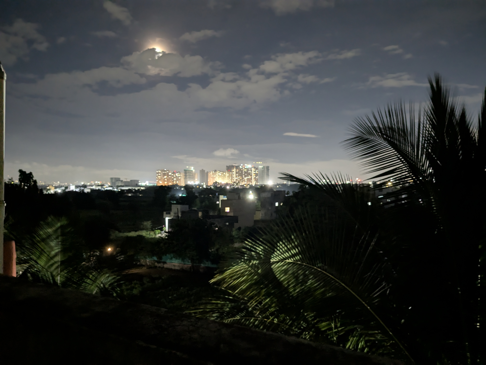

Der Zug sollte schon längst angekommen sein. Stattdessen stehe ich seit Stunden auf dem Bahnsteig, umgeben von wartenden Menschen, die sich gegenseitig anrempeln. Eine Durchsage jagt die nächste, niemand versteht genau, was los ist. Typisch, denke ich mir, während ich mein Gepäck zum dritten Mal umstelle. Diese Unpünktlichkeit, dieses Chaos, diese fehlende Organisation – man gewöhnt sich wohl nie daran. Der defekte Zug wird gekoppelt, entkoppelt, wieder gekoppelt. Menschen strömen raus, rein, wieder raus. Die Hitze im Waggon ist tropisch, der Schweiß läuft mir den Rücken hinunter.
Nur dass ich gar nicht in Indien bin. Ich stehe in Ulm.
Eine Fliegerbombe in Stuttgart hat meinen Zug nach Frankfurt lahm gelegt, mein Flug nach Indien ist längst weg.

Einen Tag später, nach einem spontanen Besuch bei meinen Großeltern, sitze ich dann tatsächlich im Flieger und kann es kaum glauben. Die wochenlange Anspannung weicht einer Mischung aus Aufregung und Ungläubigkeit. Nach Monaten der Vorbereitung und gefühlt hunderten Verabschiedungen geht es wirklich los.
Und Indien? Indien ist ziemlich genau so, wie ich es mir vorgestellt habe: Laut, voll, chaotisch. Der Verkehr übertrifft alle Vorurteile – Straßenmarkierungen sind eher Empfehlungen, gehupt wird dauerhaft und man findet nur langsam zu seinem Ziel. Zentimeter knapp überholende Busse mit offenen Türen, Fahrer am Smartphone, überbesetzte Fahrzeuge – mein Rekord liegt bei zwölf Passagieren in einer Rikscha. Dazu gesellen sich Kühe, Ziegen, Büffel und wilde Hunde auf den Straßen, während Menschen mit einer für mich unbegreiflichen Seelenruhe zwischen dem Verkehr hindurch spazieren. 
Was mich überrascht: Es funktioniert. Die Hupe hat hier eine völlig andere Bedeutung als bei uns – sie warnt vor dem Überholen, Abbiegen oder Bremsen. Auf manchen Lastwagen steht sogar „Horn please". Und während in Deutschland bei weit weniger chaotischen Verkehrssituationen geschimpft und geflucht wird, bleiben die Menschen hier gelassen.

Je länger ich hier bin, desto mehr fallen mir die Kontraste auf. Es ist eine Mischung aus Modernität und Einfachheit: Kinder sitzen im Slum vor Fernsehern, während nebenan auf offenem Feuer gekocht wird. Das Mobilfunknetz funktioniert besser als in Deutschland – selbst bei den täglichen Stromausfällen bleibt es stabil - aber die Straßen stehen nach jedem Regen unter Wasser. Fast jeder läuft mit Smartphone und Kopfhörern herum, die Frauen müssen aber gleichzeitig die traditionelle, verhüllende Kleidung tragen. Indien scheint manche Entwicklungsstufen einfach übersprungen zu haben, während es an anderen Stellen noch zu verharren scheint.

Nach den ersten Wochen merke ich: Indien feiert gerne und viel. Kaum ist der Unabhängigkeitstag vorbei, beginnen die Vorbereitungen für Ganesh Chaturthi. Zehn Tage lang wird die elefantenköpfige Gottheit gefeiert – mit einer Intensität, die mich überrascht. Jeden Morgen um sieben und jeden Abend um sieben dröhnen Gebete aus übersteuerten Lautsprechern, die überall aufgebaut wurden, während alle dazu tanzen. Am letzten Tag des Festes wird es besonders intensiv. Die Ganesh-Statue aus Ton wird auf einen geschmückten Traktor geladen und mit einer Prozession durch den Ort gefahren. Am Ende tauchen sie Ganesh ins Wasser, wo er sich auflöst und symbolisch in die Natur zurückkehrt.

:::gallery

:::

Bei Maher, der Organisation, für die ich arbeite, beginnt mein Alltag langsam, Form anzunehmen. Nach den wochenlangen Feierlichkeiten – Teacher's Day folgte auf Ganesh, dann kam der groß gefeierte Geburtstag der Gründerin von Maher Schwester Lucy, und eine Hochzeit – kehrt endlich so etwas wie Alltag ein. Morgens helfe ich in der Produktionswerkstatt, wo Ohrringe, Taschen und weiteres für den Maher-Shop hergestellt werden, nachmittags helfe ich den Kindern bei den Hausaufgaben und zu den Mahlzeiten gebe ich das Essen aus. Die Arbeit ist abwechslungsreich: Mal programmiere ich eine kleine Webanwendung, um Patientenakten zu übersetzen, mal spiele ich stundenlang Fußball und Cricket mit den Jungen oder “Reise nach Jerusalem” mit den Alten und den beeinträchtigten Frauen.

Was mich beeindruckt: Maher betreibt mittlerweile über siebzig Zentren in ganz Indien, Self-Aware-Gruppen für Frauen in ländlichen Gebieten, Essensausgaben in Slums und Computerkurse. Ehemalige Maher-Kinder arbeiten heute als Ingenieure oder Ärzte in Deutschland und den USA. Die Organisation scheint wirklich etwas zu bewegen und hat im Laufe der letzten fast 30 Jahre über 50.000 Frauen, Männern und Kindern Unterkunft geboten und Tausende durch die verschiedenen Schulungen und Unterstützungsangebote der Selbsthilfegruppen beeinflusst.

Das Leben hier ist einfacher als bei uns. Im Center Maher Vatsalyadham, in dem ich nicht nur arbeite, sondern auch wohne, gibt es keine Duschen – gewaschen wird sich mit einem Eimer und einer Tasse. Was anfangs befremdlich war, hat mittlerweile etwas Meditatives. Genauso wie das Waschen meiner Kleidung, für das ich zum Waschstein muss. 

Die ersten Wochen bei Maher sind ein einziges Warten. Indien bedeutet oft einfach rumsitzen und warten, habe ich schnell gelernt. Pünktlichkeit? Ein Fremdwort. Wenn es heißt, der Bus fährt um neun, dann ist um neun garantiert noch niemand da, erst recht nicht der Bus. Die Menschen hier sind entspannter und geduldiger, als ich es gewohnt bin, fällt mir auf, während ich zum dritten Mal an diesem Tag irgendwo sitze und warte. Pläne sind Vorschläge, Spontanität ist Programm. Anfangs frustrierend für jemanden wie mich, der Kontrolle und Planung gewohnt ist. Mittlerweile lasse ich mich treiben und lerne, dass nicht alles planbar sein muss. Stattdessen lebe ich mehr im Moment – und merke, wie entspannt das sein kann.

Aus dieser Mentalität erwächst ein Pragmatismus, der überall sichtbar ist. Design spielt keine Rolle, es muss nur funktionieren. In einem Restaurant werden einfach Fotos der Gerichte ausgedruckt – sie dienen gleichzeitig als Speisekarte und Wanddekoration. Ein schiefer Wasserhahn, der sich beim Aufdrehen mitdreht? Funktioniert doch. Die Wäscheleine direkt unter den Taubennestern? Wird schon gehen. So viel Pfusch habe ich selten gesehen, und doch: Es funktioniert alles irgendwie.

:::gallery

:::

Dieser fehlende Perfektionismus ist anfangs befremdlich für mich, der in Deutschland aufgewachsen ist, wo alles seine Ordnung haben muss. Die Tänze bei den Festen sind nie synchron, die Musik immer übersteuert. Beim monatlichen Putztag kehren wir Staub auf einer staubigen Straße, neben staubigen Feldern. Manchmal denke ich: Das ist doch Unsinn. Aber dann sehe ich, wie die Menschen hier mit einer Leichtigkeit durchs Leben gehen: Sie verschwenden keine Energie auf Perfektion. Es muss nicht schön sein, es muss funktionieren.

Je länger ich hier bin, desto mehr wird mir klar: Unter all den kulturellen Unterschieden sind wir uns ähnlicher, als ich dachte. Ja, die Frauen tragen traditionelle Gewänder, während sie durch den Müll zur Arbeit gehen. Männer laufen Hand in Hand, was für mich erst einmal gewöhnungsbedürftig ist. Man sitzt auf dem Boden, isst mit den Händen, berührt zur Begrüßung auch mal die Füße des Gegenübers. Der Alltag sieht anders aus. Aber die Gefühle sind dieselben. Sie lieben, lachen und weinen aus denselben Gründen wie wir. Sie haben Hoffnungen und Ängste wie wir. Die Geschichten mögen anders sein, aber das menschliche Herz schlägt überall gleich.

Manchmal denke ich an den Ulmer Hauptbahnhof zurück. An das deutsche Chaos, die Verzweiflung der Menschen  wegen ein paar Stunden Verspätung. Hier würde man darüber lachen. Nicht aus Schadenfreude, sondern aus Unverständnis, warum man sich über etwas aufregt, das man nicht ändern kann. 

Nach einem Monat verstehe ich langsam: Das vermeintliche Chaos hat System. Die Unpünktlichkeit ist eingeplant. Der Verkehr funktioniert trotz – oder gerade wegen – der fehlenden Regeln. Ich habe gelernt, mit den Händen zu essen – etwas, das ich zuhause nie ausstehen konnte. Die Technik habe ich mittlerweile halbwegs raus, elegant ist es noch lange nicht. Aber auch hier gilt: Es funktioniert, und das ist, was zählt. Ich habe gelernt zu warten, ohne ungeduldig zu werden. Wenn zum x-ten Mal der Strom ausfällt, während ich dusche. Wenn die Wäsche nach zwei Tagen im Monsunregen dreckiger ist als vorher. Wenn wir stundenlang warten, ohne zu wissen, worauf eigentlich. Früher hätte mich das wahnsinnig gemacht. Jetzt zucke ich mit den Schultern. Ich habe gelernt, die Kontrolle abzugeben und mich treiben zu lassen. Vielleicht ist das die wichtigste Lektion: Loslassen. Nicht alles muss perfekt sein. Nicht alles muss geplant werden. Manchmal ist das Leben einfach das, was passiert, während man wartet.

Die wichtigste Erkenntnis aber ist eine andere: Wir sind uns viel ähnlicher, als wir denken. Die Art, wie wir leben, mag sich unterscheiden. Aber warum wir leben, wofür wir leben – das ist überall gleich. Familie, Freundschaft, Gemeinschaft, Freude. Indien ist ein Land, das mich lehrt, dass Perfektion überbewertet ist und dass im Chaos oft mehr Leben steckt als in all unserer deutschen Ordnung. Und dass wir alle, trotz aller Unterschiede, einfach nur Menschen sind.

