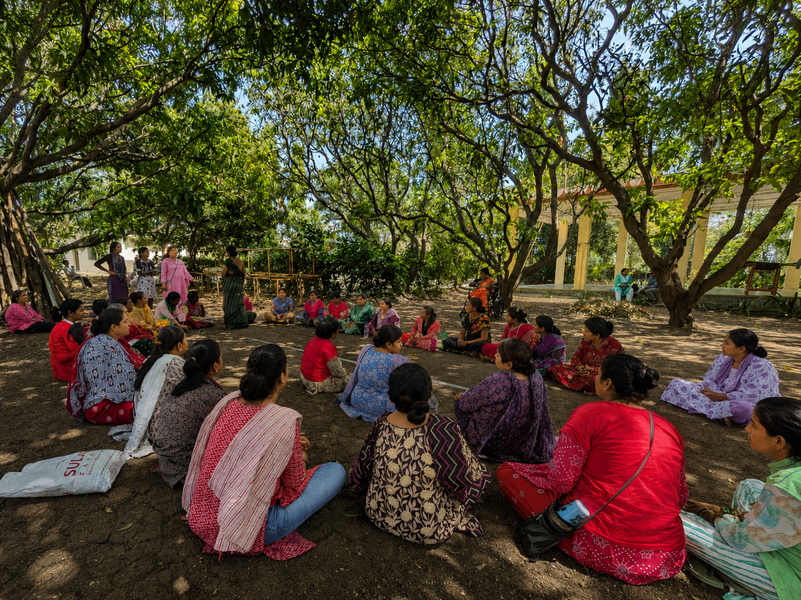
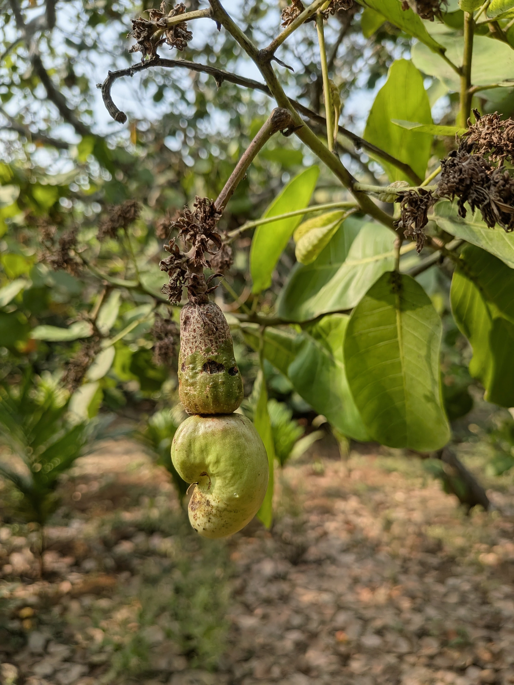
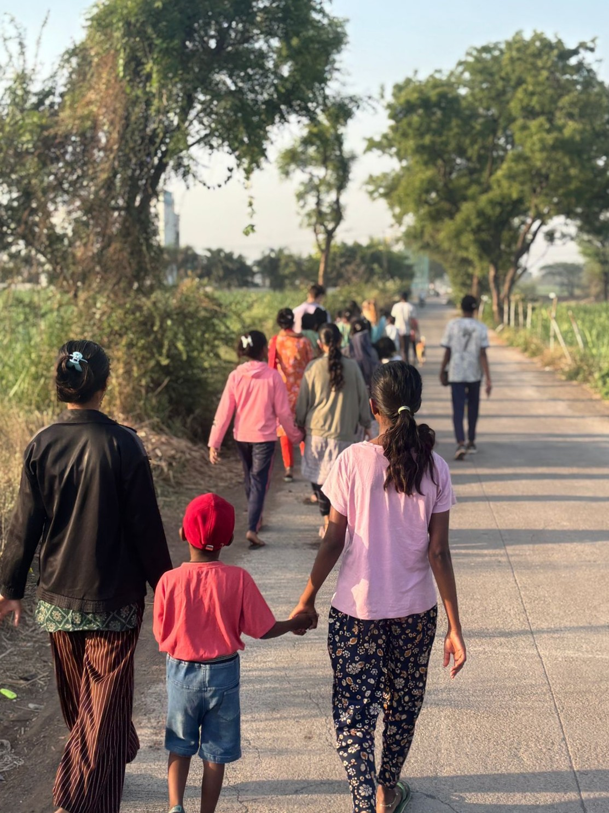
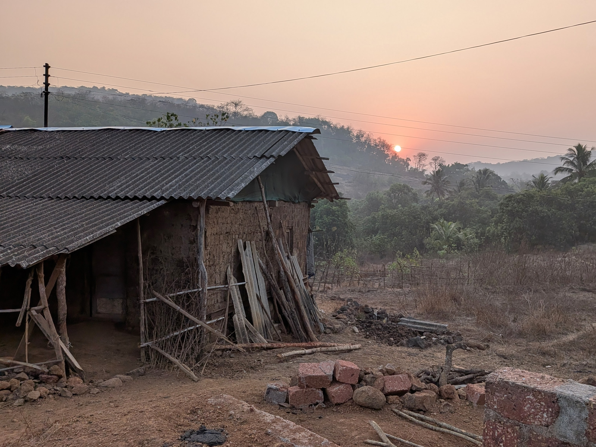
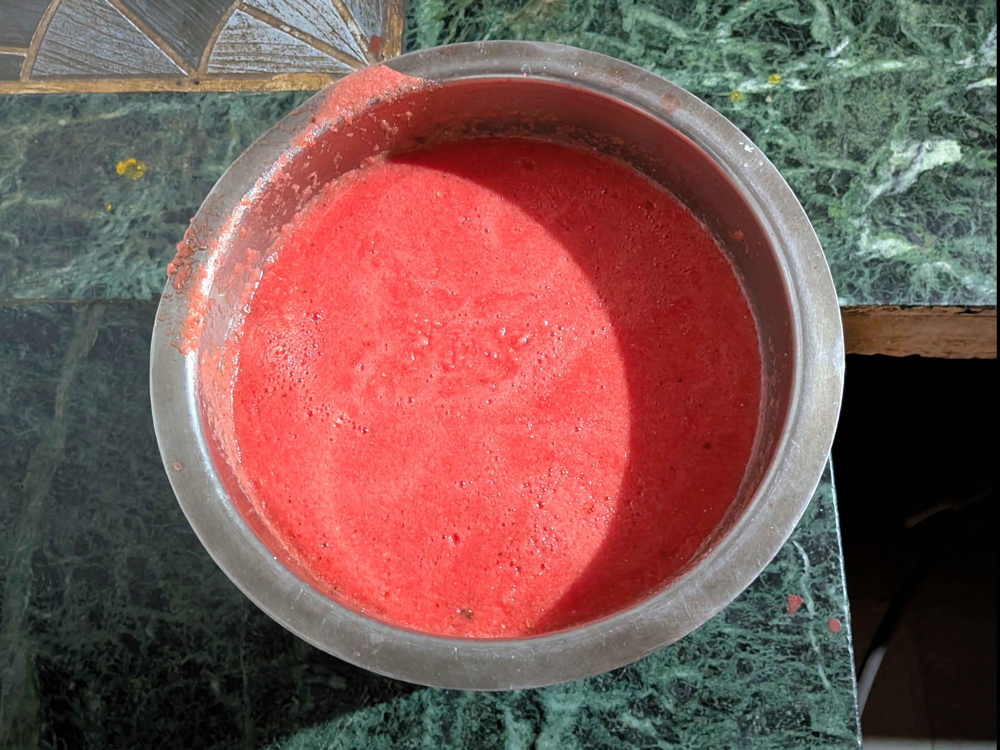
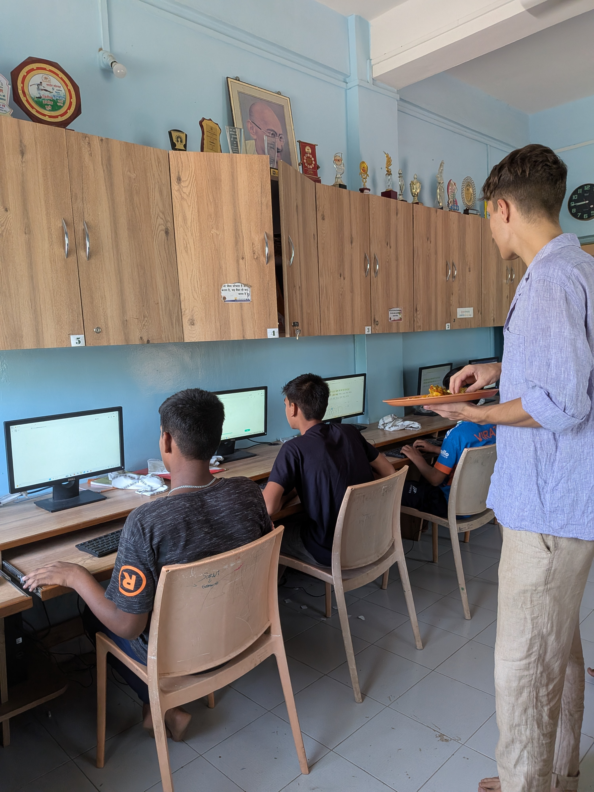
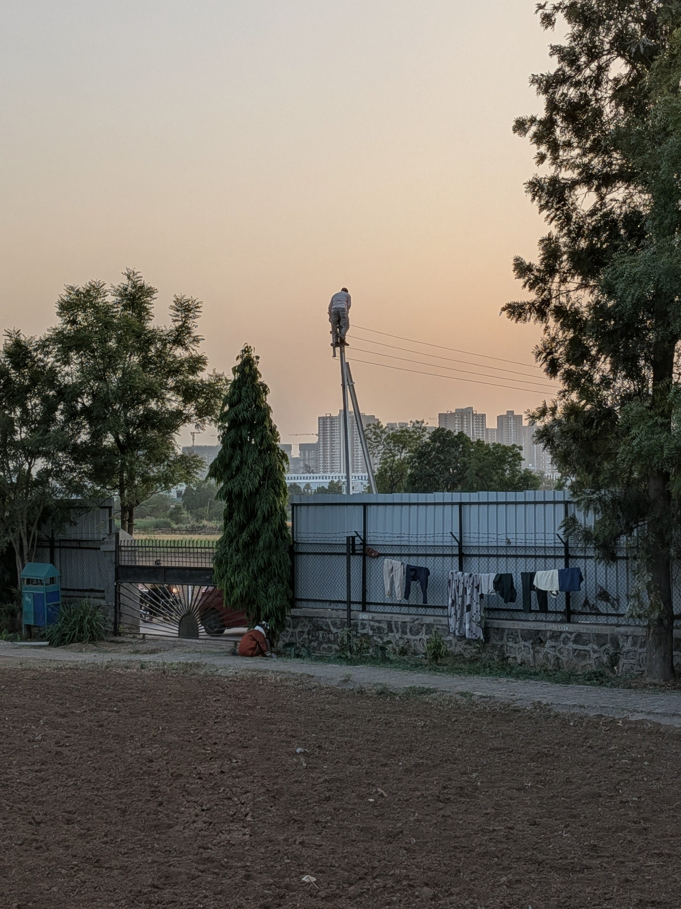
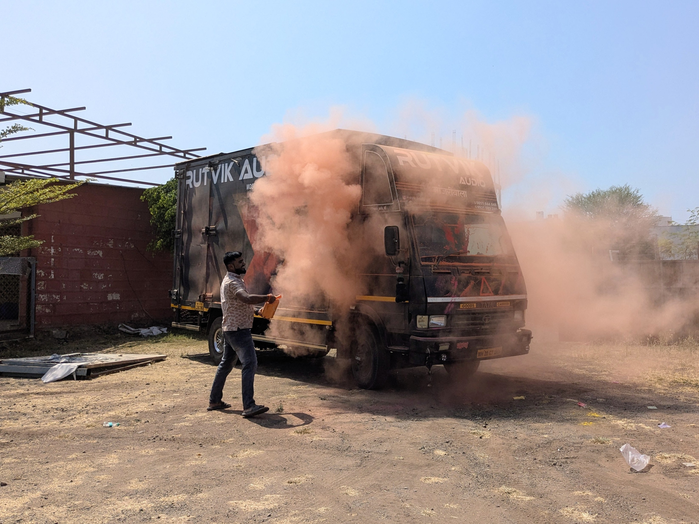

Und dann war sie weg. - Jayshree ist siebzehn. Sie war gerade dabei ihren Abschluss zu machen. Jetzt heiratet sie. Den ganzen Vormittag haben die Sozialarbeiterinnen auf sie und ihre Mutter eingeredet: Sie sei noch nicht mit der Schule fertig, sie hätte so viel Potential, würde so gut Englisch sprechen. Sie solle die Entscheidung selbst treffen, sobald sie volljährig sei. Die Mutter war anderer Meinung, schließlich sei es ihre Tochter und der Sohn ihrer Nachbarin suche eine Frau.

Jayshree ist nicht alleine. 

Im Center sitzt Samiksha, die mir manchmal auf Englisch von ihrem Leben erzählt. Sie hat einen Master-Abschluss. Sie heiratete aus Liebe einen Mann aus einer niedrigeren Kaste. Ihre Familie trennte sich daraufhin von ihr. Der Mann verließ sie ebenfalls. Jetzt sitzt sie hier zwischen den anderen Patientinnen und wartet. Worauf? Dass ihr Mann anruft. Sie ist überzeugt, er wird anrufen. Irgendwann. Er wird sie zurückholen.

Nandini kam aus Kaschmir, bevor sie überhaupt eine Wahl treffen konnte, wohin. Ihre Familie gehörte zu den Kaschmirischen Pandits, die in den frühen Neunzigern vertrieben wurden und seitdem an Orten lebten, die nie ihr zu Hause wurden. In Pune haben sie sich eingerichtet, so gut es ging, in bescheidenen Verhältnissen. Nandini hat geheiratet, hat gearbeitet, hat versucht, das Leben in eine Form zu bringen. Dann hat die Familie ihres Mannes angefangen, dieses Leben langsam zu demontieren. Nicht mit Schlägen zunächst, sondern mit dem, was auch keine Spuren hinterlässt: mit Worten, mit Demontage, mit dem täglichen kleinen Zermürben. Am Ende stand sie auf der Straße, auf der Suche nach Arbeit, der Job hielt nicht, und irgendwann fand die Polizei sie. So kommt man hierher.

:::gallery

:::

Raj wurde unter einem Baum auf einem Markt in Pune gefunden. Er war fünfundvierzig Jahre alt, seine Kleider zerfetzt, seine Beine von offenen Wunden bedeckt, in denen sich Maden bewegten. Er murmelte vor sich hin, an der Realität vorbei. Die Polizei brachte ihn her. In den ersten zehn Tagen floh er dreimal. Dann kam die Diagnose: Lepra.
Was bringt Menschen hierher? Nicht Pech, nicht persönliches Versagen, nicht schlechter Charakter. Die Antwort ist: ein Teufelskreis, für den es keinen einzelnen Schuldigen gibt: Armut. Gewalt. Das Kastensystem. Fehlende Absicherung. Psychische Erkrankungen ohne Behandlung. Für Frauen bedeutet das oft Verstoßung und eine ökonomische Katastrophe. Eine Heirat in die falsche Kaste, eine Krankheit, die ausbricht, ein Mann, der schlägt oder verschwindet. Dann ist die Frau allein. Ohne Geld, ohne Schutz, ohne Zuhause. Die Krankheit verschlimmert sich auf der Straße. Die Straße macht krank. Ein Teufelskreis, in dem Ursache und Folge nicht mehr zu trennen sind.

Die Männer, die in Maher landen, kommen auf anderen Wegen. Armut, die so drückend ist, dass Alkohol der einzige Ausweg scheint. Sucht, die in Obdachlosigkeit mündet. Auch hier: Krankheit und Umstände bedingen einander.

Und darunter liegt immer eine biologische Verwundbarkeit. Niemand wählt eine psychische Erkrankung. Niemand entscheidet sich für Schizophrenie, für Depressionen, für die Unfähigkeit, mit Stress umzugehen. Diese Verwundbarkeit trifft Menschen überall, aber wo sie trifft, entscheidet über alles. In Deutschland kann man Hilfe suchen. Hier gibt es oft keine.

Aber psychische Erkrankungen sind behandelbar. Samiksha beweist es. Mit Medikamenten kann sie wieder klar sprechen, klar denken, arbeiten. Die Tabletten wirken. Die Frage ist nur: Wer bekommt Zugang zu ihnen? 

Eines der Dinge, was mich auch nach Monaten noch trifft: Kinder werden mitunter geschlagen. Nicht überall, nicht von allen - aber wer zu spät zur Schule kommt, wird mit dem Stock auf die Finger geschlagen. Gewalt als Erziehungsmethode war in der Welt, in der ich aufgewachsen bin, keine Option, keine Lösung, kein letztes Mittel. Dass das keine Selbstverständlichkeit ist, wird einem erst klar, wenn man die Welt verlässt, in der man es für selbstverständlich gehalten hat. Gewalt als legitimes Mittel beginnt im Elternhaus, lebt weiter in der Schule - und irgendwann schlägt der Ehemann seine Frau, die das Kind schlägt.

Einige Wochen später versuchen wir, Samiksha wieder bei ihrer Familie unterzubringen. Stunden lang fahren wir durch die Weite Indiens. Irgendwann halten wir vor einem Haus. Lehm und Ziegel, ein kleines Vordach, Hühner auf dem Hof. Der Bruder ihres Ehemannes kommt heraus. Er erkennt sie, nickt, sagt etwas. Nein, der Ehemann ist nicht hier. Schon lange nicht mehr. Er zieht herum, arbeitet als Künstler irgendwo, trinkt wahrscheinlich. Niemand weiß genau wo. Stattdessen verweist der Bruder uns zu seiner Schwester. Später sitzen wir auf dem Bett in einer Ein-Zimmer-Hütte, im Hintergrund läuft der Fernseher - “Taarzan: The Wonder Car", ein Bollywood-Kultfilm. Die Schwester des Mannes empfängt uns freundlich, kocht Tee, erklärt ruhig, dass sie die beiden Kinder ihres Bruders versorgt, nachdem dessen Frau gegangen ist. Sie kann Samiksha nicht aufnehmen. Mehr geht nicht. Wir fahren zurück. Samiksha wird als Betreuerin in einem Center arbeiten, bis ihr Mann gefunden ist. Falls er gefunden wird. 

Ein paar Tage später bin ich bei Jitesh eingeladen. Er ist ein ehemaliges Maher-Kind. Heute arbeitet er für eine amerikanische Firma. Er hat sich gerade eine Wohnung gekauft, im elften Stock eines Hochhauses. Pool und Basketballplatz inklusive. Die Einweihungsparty ist groß. Seine Geschwister sind da. Beide ebenfalls ehemalige Maher-Kinder. Beide ebenfalls bei amerikanischen Firmen angestellt. Sie erzählen, dass die Zeit bei Maher schön war. Wirklich schön. Sie vermissen es manchmal.

Warum schaffen es manche und andere nicht? Die Antwort ist vielschichtig. Aber ein Teil davon ist klar: Die, die durchkommen, hatten einen Moment, in dem sich eine Tür öffnete. Eine Schule, die Englisch unterrichtet. Eine Sozialarbeiterin, die ihnen glaubt. Ein Zufall, der ihnen Zeit gibt, bis sie achtzehn sind.

Abends sitze ich mit Imran auf einer Bank unter einem Baum. Er ist so alt wie ich und seit er vier ist bei Maher. Wir trinken Wassermelonensaft, den wir selbst gemacht haben. Die Wassermelone war nicht besonders rot. Der Saft ist entsprechend fade. Aber wir trinken ihn trotzdem.
Imran erzählt von seinem Traum: erst Hotelmanager werden, dann ein Handy kaufen, dann ein Motorrad, dann ein Haus bauen, und dann - das stand am Ende der Liste, klang aber wie das Wichtigste - seine Mutter aus Maher holen und bei sich wohnen lassen.

Da wird mir klar, sein Traum ist meine Realität. Wir leben den Traum der Menschen hier. 

Nandini erkannte nach einigen Monaten den Wohnblock ihrer Eltern auf Google Maps wieder und fand so den Weg zurück zu ihrer Familie. 
Raj konnte nach einer Operation geheilt werden und hilft heute anderen Patienten beim Waschen, Ankleiden und Aufstehen. 

Zwei Wochen nach jenem Morgen kam Jayshree zurück. Ihre Eltern hatten entschieden, dass sie die Schule noch beenden soll. Vielleicht war es Überzeugungsarbeit. Vielleicht war es Glück. Wahrscheinlich beides.

