Goa, irgendwo in der flachen Landschaft kurz vor der Küste. Vierundzwanzig Stunden sitze ich schon in diesem Zug, und eigentlich hätte ich seit einer Stunde bereits am Strand liegen sollen. Stattdessen rolle ich durch eine leere Prärie, bis der Zug an einem kleinen Bahnhof mit einem einzigen Gleis zum Stehen kommt. Kein Ortsschild, soweit ich sehen kann. Ich greife zum Handy. Laut der ersten Bahn-App brauche ich noch eine halbe Stunde. Mein Standort in Google Maps hängt im letzten Tunnel fest. Die zweite App lädt. Die dritte sagt: angekommen. Mein Herz beginnt schneller zu schlagen. Ich tippe die Männer neben mir an der Schulter, sie diskutieren kurz miteinander und nennen dann meinen Zielbahnhof. Adrenalin schießt durch meinen Körper. Hastig suche ich meine Sachen zusammen - der Zug beginnt wieder zu rollen. Ich schmeisse mir den Rucksack über die Schultern und springe auf den Bahnsteig. Ich lande. Stehe. Atme. 
Indien ist meistens tiefenentspannt. Und dann, auf einmal, geht alles sehr schnell.

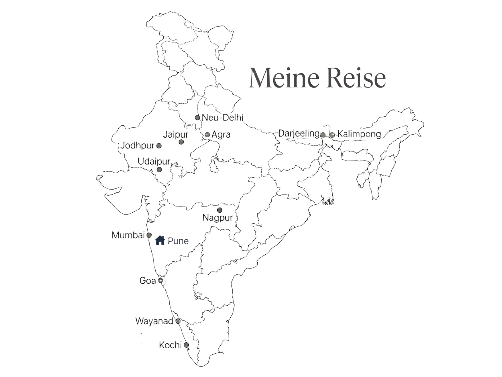

Wenige Minuten nach diesem Sprung liege ich endlich bei 30 Grad am Strand. Das Meer ist warm und flach, irgendwo weit draußen treiben Fischerboote – so beginne ich meinen Urlaub und damit meine Reise durch Indien. Drei Wochen später friere ich in Darjeeling unter drei Decken, weil das Haus des Jesuiten, bei dem ich übernachte, keine Heizung hat. Sechs Grad, in der Nacht noch weniger. Zwischen diesen beiden Momenten: Kerala mit seinen Backwaters und den weiten, leuchtend grünen Reisfeldern - die blauen Gassen von Jodhpur, wo die gesamte Altstadt in einem einzigen Farbton getaucht ist, als hätte jemand eine riesige Schale Himmelblau über die Häuser gekippt - die Stadtpaläste in Udaipur, die sich in dem See darunter spiegeln und ein bisschen wie Venedig aussehen - die roten Sandsteinfestungen von Jaipur - die Basare Delhis, wo ich schnell gelernt habe, dass derjenige, der höflich auf eine Lücke in der Menge wartet, keine bekommt. Das sind nicht nur verschiedene Städte. Das sind verschiedene Länder.

:::gallery
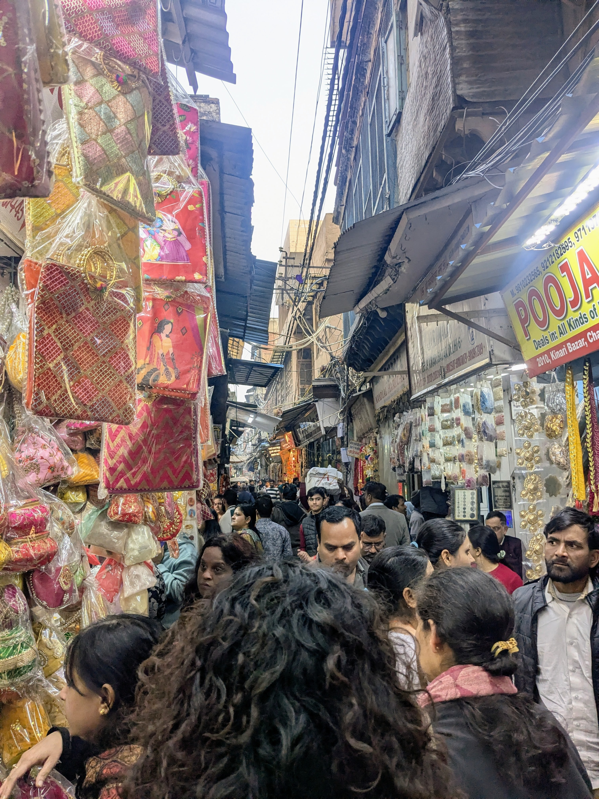
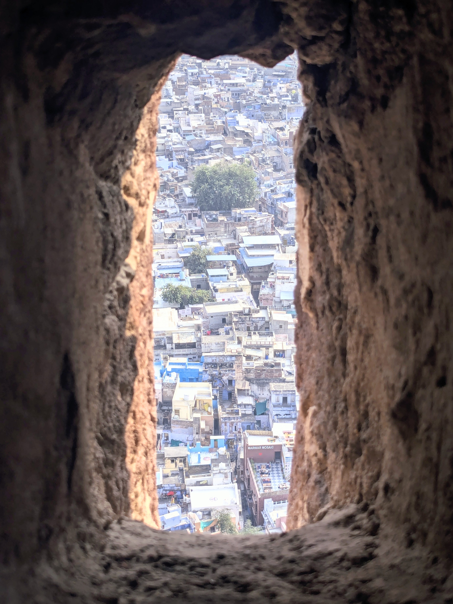
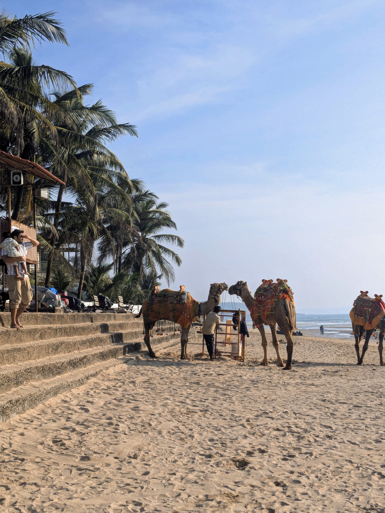
:::

Im Norden, in den Ausläufern des Himalaya rund um Darjeeling und Kalimpong, fühlt sich Indien am allerwenigsten wie Indien an - zumindest nicht wie das Indien, das ich bisher erlebt habe. Dunkelgrüne Teefelder im Wolkennebel, tibetisch anmutende Tempel, enge Gebirgssiedlungen - und Gesichter, die einen immer wieder kurz innehalten lassen, weil sie nicht wie das Indien aussehen, das man kennt. Die Mehrheit der Menschen hier sind Gorkhas - Nachkommen nepalesischstämmiger Einwanderer, die seit dem 19. Jahrhundert in diesen Bergen zu Hause sind. Wer nicht weiß, wo er ist, könnte glauben, er wäre unbemerkt über die Grenze nach Nepal gewandert. Tatsächlich fehlen von hier nur wenige Kilometer bis zu eben dieser Grenze.

Im Süden in Kochi hingegen: rote Graffiti von Hammer und Sichel an den Hauswänden, Symbole des Kommunismus, die hier seit Jahrzehnten zum Stadtbild gehören. Hier treffe ich Sumukh, auf einer Fähre nach Fort Kochi. Er ist Inder, aus Bangalore, und in Kerala so verloren wie ich: mit den Einheimischen sprechen wir beide Englisch, weil er Malayalam genauso wenig versteht wie ich. Indien hat über hundert Sprachen und Dialekte, von denen die Verfassung zweiundzwanzig als Hauptsprachen anerkennt. Aber nicht nur die Sprache unterscheidet die Orte. In einer Stadt liegt kaum Müll auf der Straße, in der nächsten wühlen wilde Schweine ungestört an den Straßenrändern. Welches Fleisch auf einem Marktstand liegt, sagt oft mehr über eine Stadt aus als jeder Reiseführer: ob die Mehrheit Hindu ist oder muslimisch, wie tief die Religiosität sitzt, was die Menschen seit Generationen essen und was nicht. Auch der Reichtum der Menschen schreibt sich ins Stadtbild ein: in funktionierender Infrastruktur, sauberen Gehwegen und geordnetem Verkehr - oder in brüchigen Straßen, offenen Abwasserkanälen und improvisierten Lösungen. Indien ist nicht gleich Indien. 

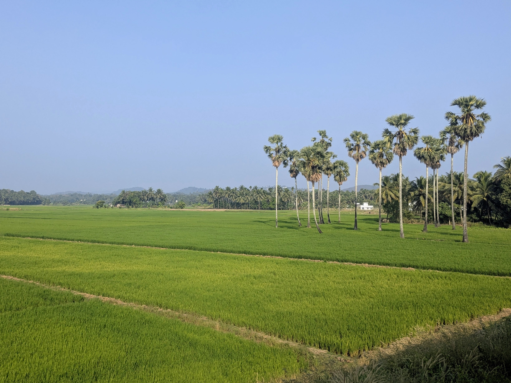

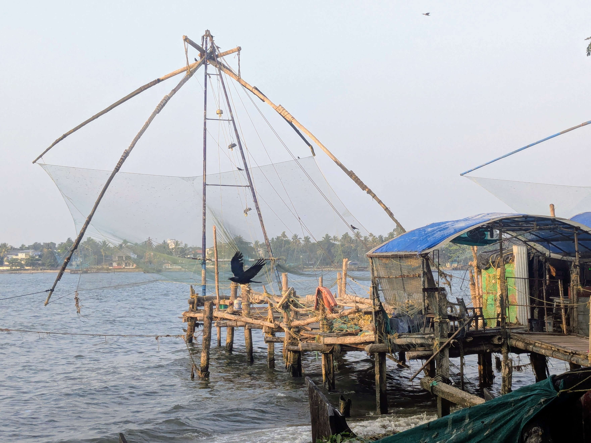

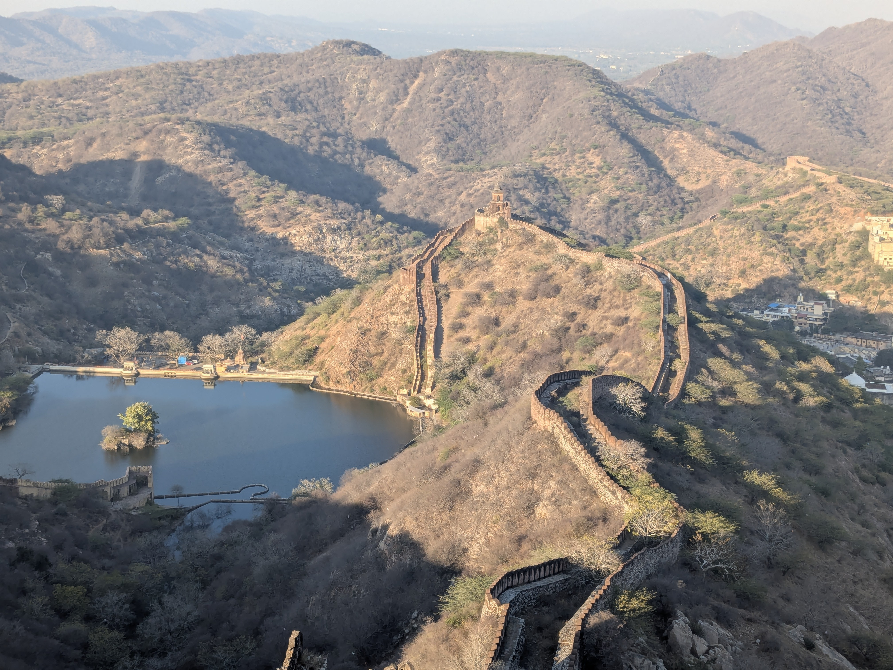

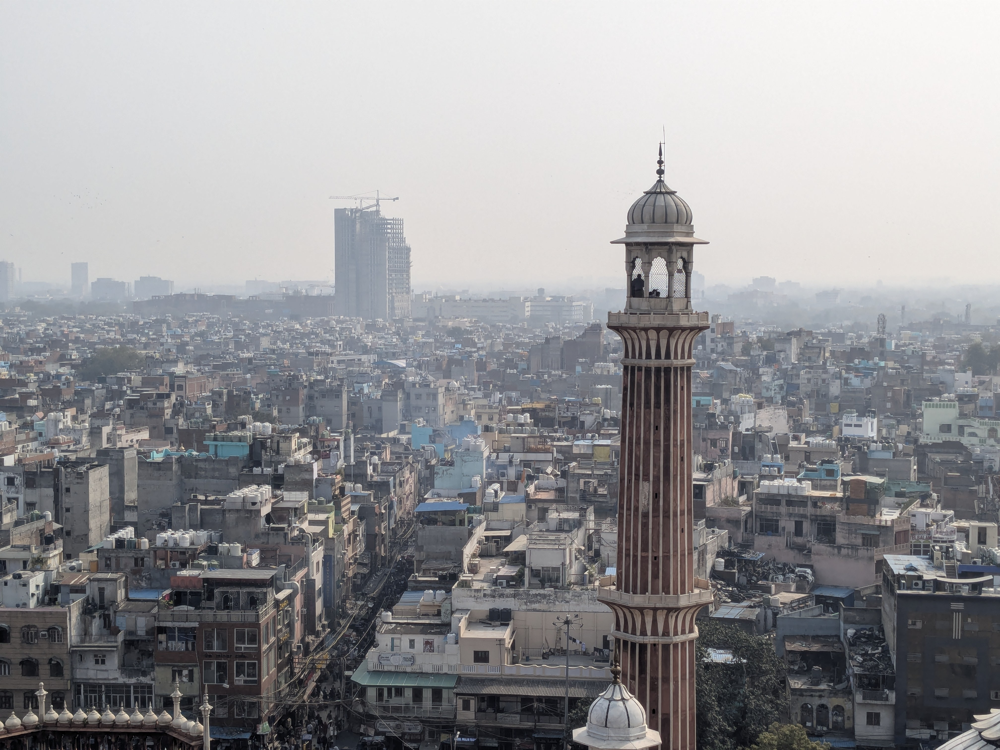

Durch all diese Orte kommt man vor allem per Zug. Der Zug ist hier keine reine Transportoption, er ist ein sozialer Ort. Unterste Klasse, Sleeper: drei Pritschen übereinander, schmal, kein Kissen, keine Decke. Von Pune nach Kerala: vierundzwanzig Stunden für 7,50 Euro. Nachts legen Fremde ihre Sachen auf dein Bett. Irgendwo schaut jemand bis Mitternacht lautstark Reels. Körper an Körper, kein Konzept von persönlichem Raum. Wer sich die 2A-Klasse leistet, reist hingegen fast luxuriös: zwei Betten übereinander, breiter, eine Decke, Kissen, Essen inklusive, und nachts tatsächlich Stille. Eine andere Welt - im selben Zug, auf denselben Schienen. Die Zugklassen sind ein eigener kleiner Gesellschaftsspiegel. Das Schönste am Zugfahren hier ist die Zeit, die es braucht. Strecken dauern nicht eine Stunde, sondern zwölf, vierundzwanzig, sechzig. Man schaut aus dem Fenster auf Backwaters und Reisfelder, redet mit dem Nachbarn, schläft. An einer Haltestelle reicht mir jemand durch das Fenster eine Tüte mit Pizza - online vorbestellt, das funktioniert tatsächlich. Die Reise ist das Ziel. Das einzige Problem, wie gesagt, ist der Moment des Aussteigens.

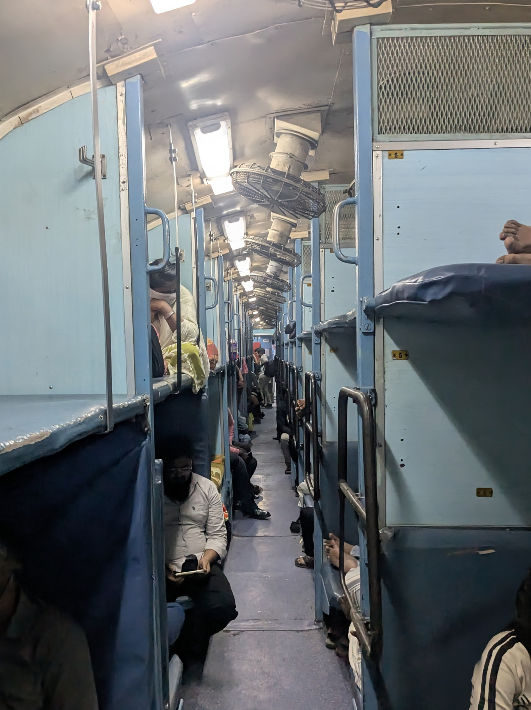

Was nicht funktioniert: lokale Busse finden. Die meisten sind nirgendwo online eingezeichnet. Kein Google Maps, kein Fahrplan, keine App. Man geht einfach dorthin, wo Busse stehen, schaut, welches Reiseziel auf den Bus geschrieben ist, und wenn es nicht das richtige ist, fragt man. Und fragt wieder. Und irgendwann sagt jemand: dort drüben, der Mann, der weiß es. Und tatsächlich, er weiß es. Indien funktioniert nicht über Systeme, sondern über Menschen. Das klingt unbefriedigend, bis man merkt, dass es eigentlich immer klappt. Alternativ: Überraschend bequeme Schlafbusse mit eigenen Betten und “Shared Cars”  - bei denen man sich zu neunt in einen Jeep quetscht und das Gepäck auf das Dach schnallt.

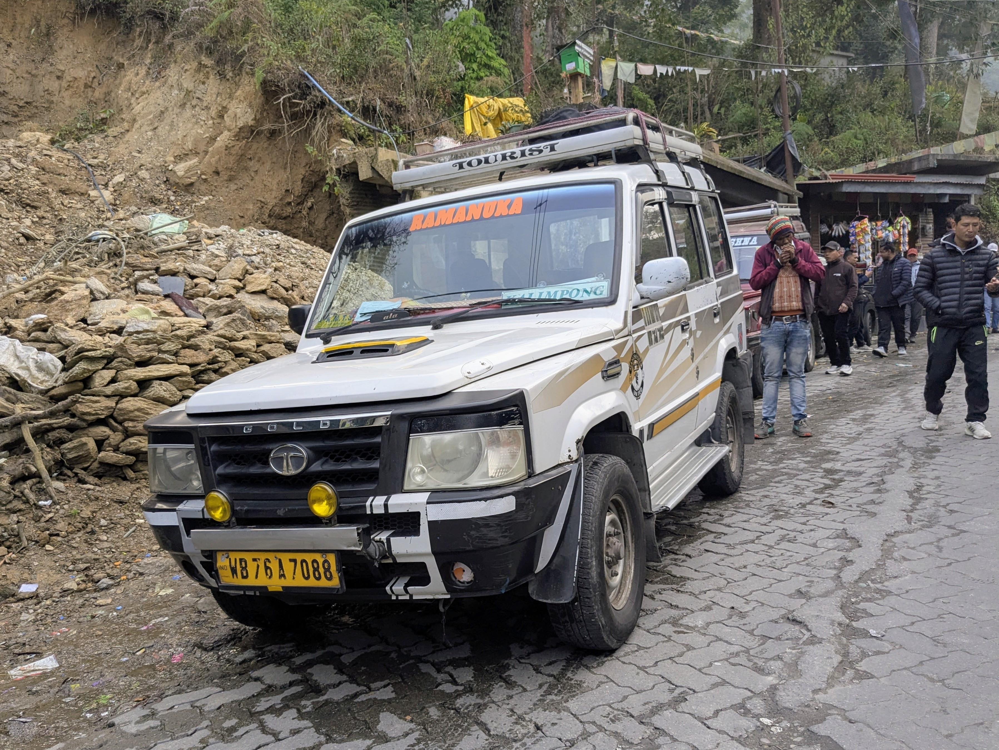

Sechs Cent für die Fähre nach Fort Kochi. Fünfundzwanzig Cent für einen Brief nach Deutschland. Ein Euro für 150 Kilometer von Pune nach Mumbai. Und dann, in Kerala: eine Hochzeit mit teuren Limousinen vor der Kirche, Gäste aus Abu Dhabi und von der UN, der Bräutigam Armeeoffizier. In Darjeeling sehe ich einen Träger mit fast siebzig Kilogramm Wasserflaschen auf dem Rücken. Er verdient drei bis vier Euro am Tag. An der Strandpromenade in Mumbai spricht mich ein Informatiker an. Wir reden über Fußball, über Deutschland, und dann fragt er, ob ich ihm einen Job in Deutschland vermitteln kann. Er verdient 7.500 Euro im Jahr, nach Steuern. Fast jeder Mensch, mit dem ich hier tiefer ins Gespräch komme, hat eine Verbindung nach Deutschland: Vergangenheit, Verwandte, Vorhaben. Viele sagen unaufgefordert, warum: Indien sei ihnen zu korrupt und Deutschland habe die Möglichkeit zu einem besseren Leben. 

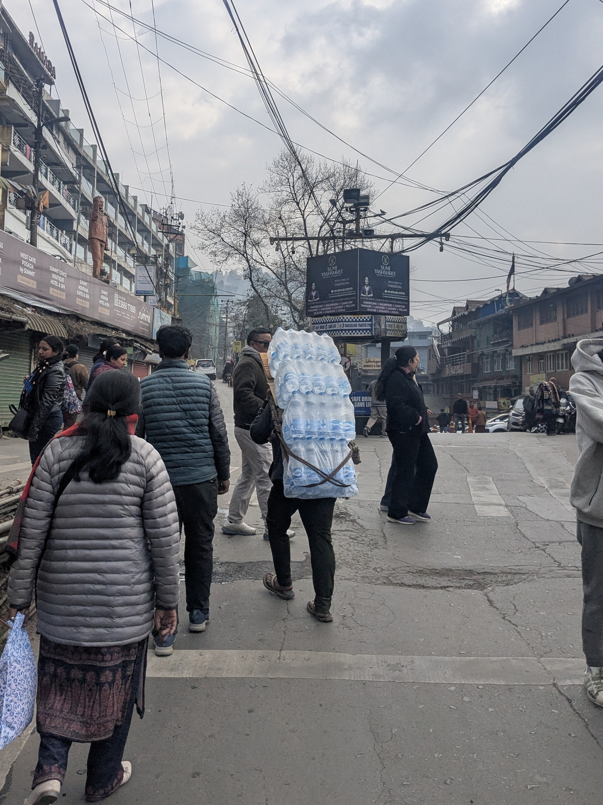

Langsam, fast unmerklich, lerne ich hier aber auch das Misstrauen. Der Rikschafahrer nennt einen Preis, der doppelt so hoch ist wie beim Losfahren ausgemacht. Der Schalverkäufer schwört, der Stoff sei reine Edelwolle - er fühlt sich an wie Plastik - und erzählt mir dazu seine Familiengeschichte. Irgendwann schaue ich jeden Preis zweimal an. Das nervt nicht wegen des Geldes. Es nervt, weil ich aus einer Kultur komme, in der man dem Preisschild vertraut. Und gleichzeitig: Einmal stehe ich am Ticketschalter und komme nicht weiter, weil der Kauf ein indisches Bankkonto erfordert. Ein Fremder schaut kurz rüber, versteht die Situation, zahlt einfach. Ich versuche, ihm das Geld zurückzugeben. Er winkt ab. In Jaipur bekommen wir nachts kein Taxi mehr von einer Burg zurück in die Stadt. Wir halten vorbeifahrende Autos an. Irgendwann nimmt uns eines mit, zwei Männer fahren uns bis vor die Hosteltür.

Es sind dieselben Menschen. Das ist das Verwirrende, und irgendwann auch das Versöhnliche.

Stadtleben in Indien bedeutet immer auch: Tiere. Kühe stehen mitten auf der Fahrbahn und keine Hupe der Welt bewegt sie. Pfauen stolzieren durch die wenigen grünen Oasen der Stadt, Hunde schlafen auf Gehsteigen, Ziegen klettern über Trümmerhaufen. Affen springen von Dach zu Dach und führen im Großen und Ganzen dasselbe Leben wie die Menschen ringsum: fressen, spielen, streiten, in der Sonne dösen.

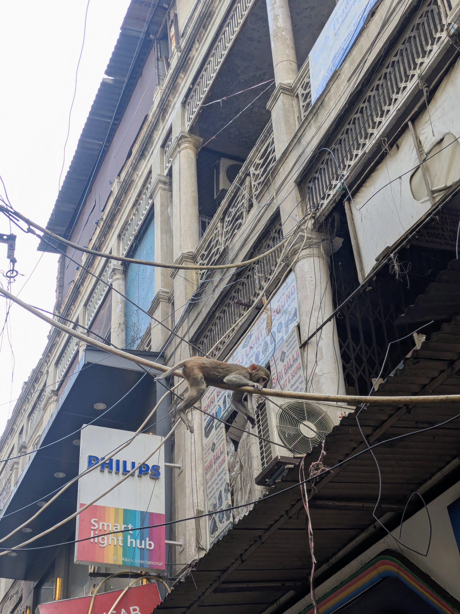

In Agra frühstücke ich auf der Dachterrasse meines Hostels. Die Luft ist kühl und schwer, und irgendwo hinter dem Smog und dem Morgennebel steht das Taj Mahal. Man sieht es nur als Andeutung: ein weißer Umriss, der für einen Moment durch den Dunst scheint und gleich wieder verschwindet. Mystischer als jedes Foto. Während ich sitze und auf diesen Umriss warte, bemerke ich auf den Nachbardächern eine Affenfamilie: die Mutter kratzt dem Kleinen den Rücken, ein junger Affe springt aufgeregt zwischen zwei verrosteten Antennen hin und her, ein älterer sitzt breit da und schaut mit der Würde eines erfahrenen Pensionärs auf die Straße hinunter.

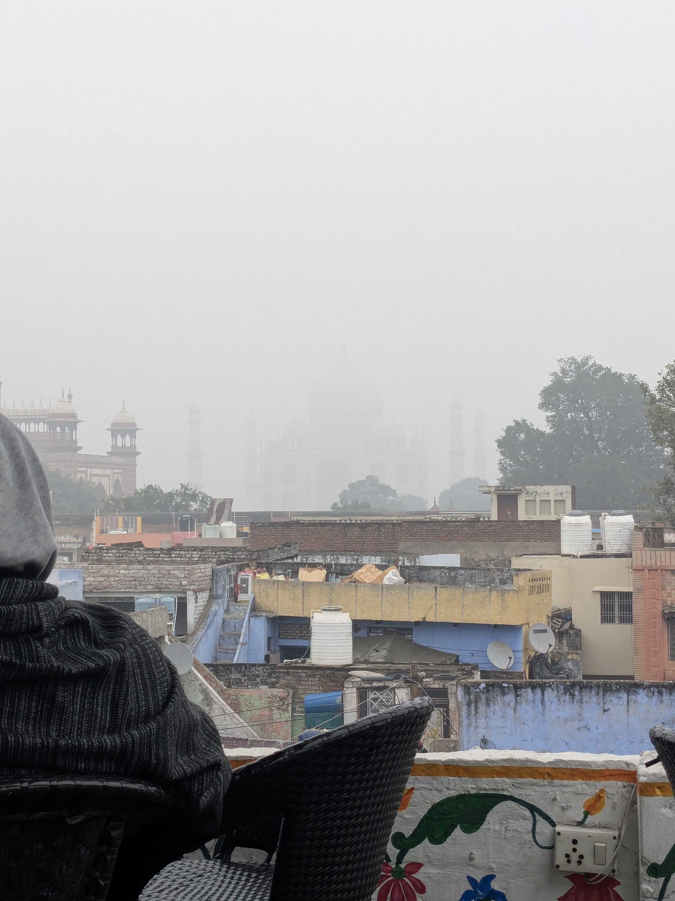

Sechs Wochen war ich in Indien unterwegs. Ich habe mich durch Bahnhöfe und Busbahnhöfe durchgefragt, weil es keine andere Möglichkeit gab. Ich bin aus einem fahrenden Zug gesprungen. Ich wurden von Fremden nach Hause eingeladen. Und jedes Mal, wenn ich gefragt habe - ob nach einem Bus, nach einem Ortsschild, nach dem Weg - hat mir jemand geantwortet. Man fragt sich durch, und man kommt immer irgendwo an. Nicht weil das System zuverlässig ist. Sondern weil immer jemand da ist.

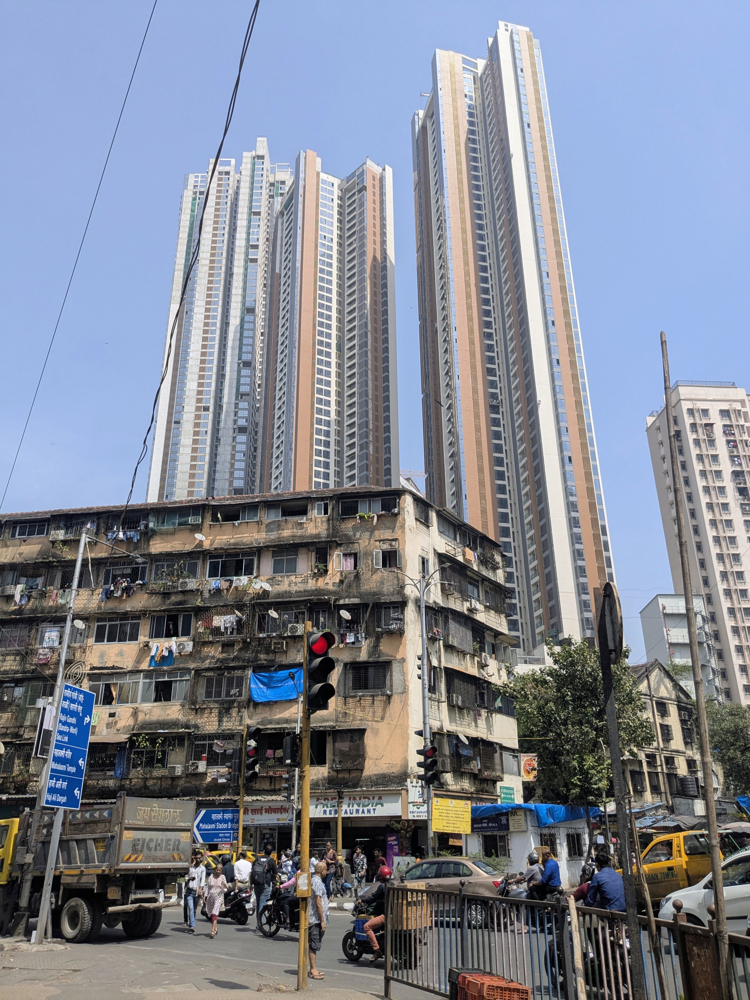

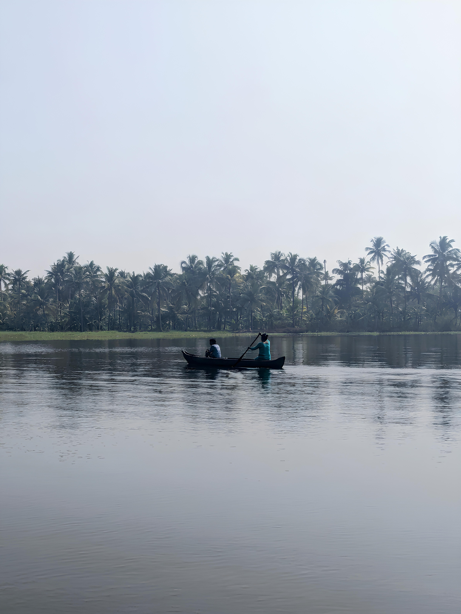

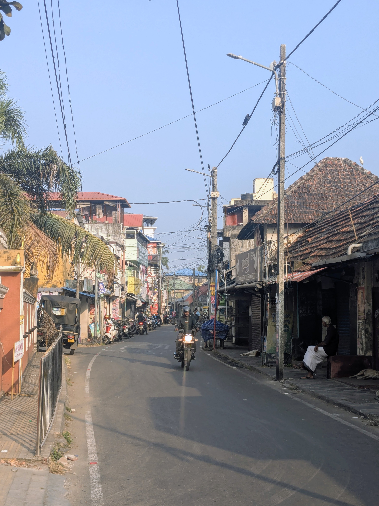

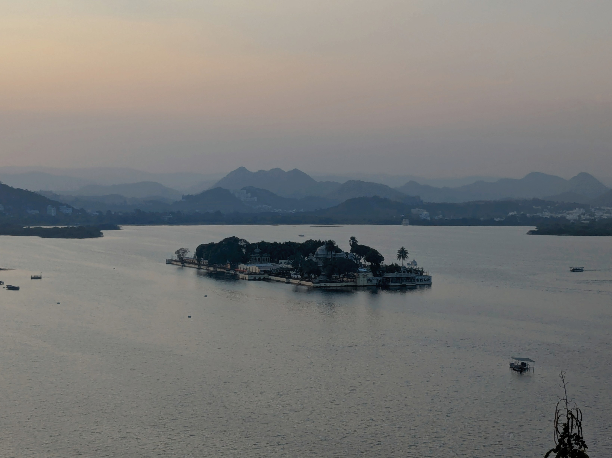

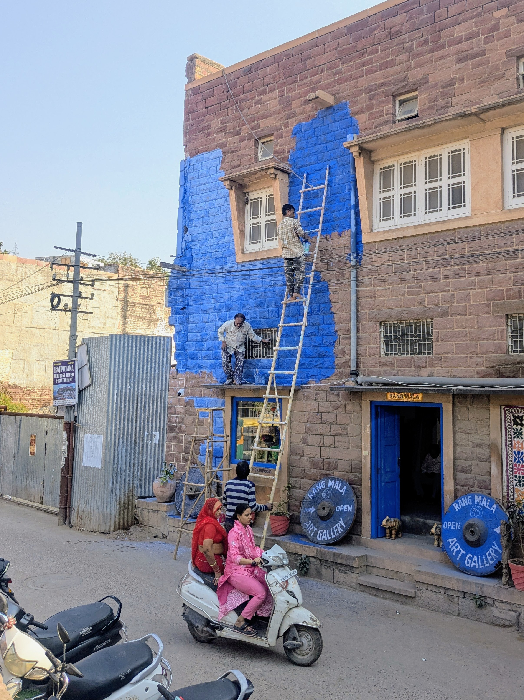

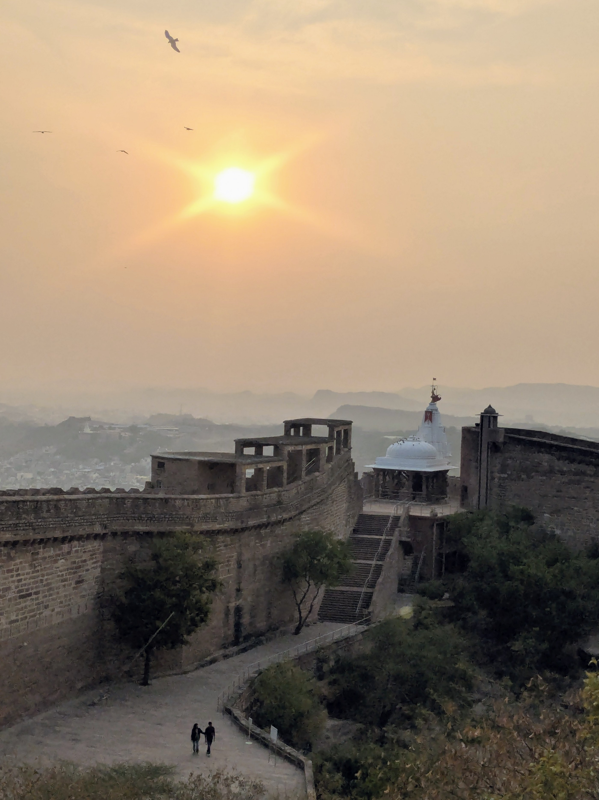

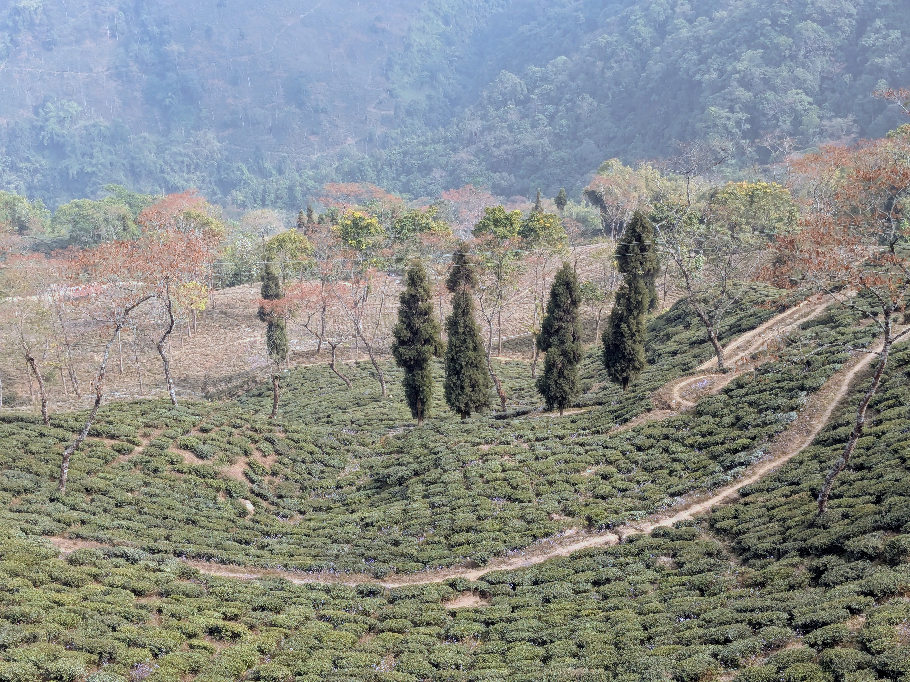
