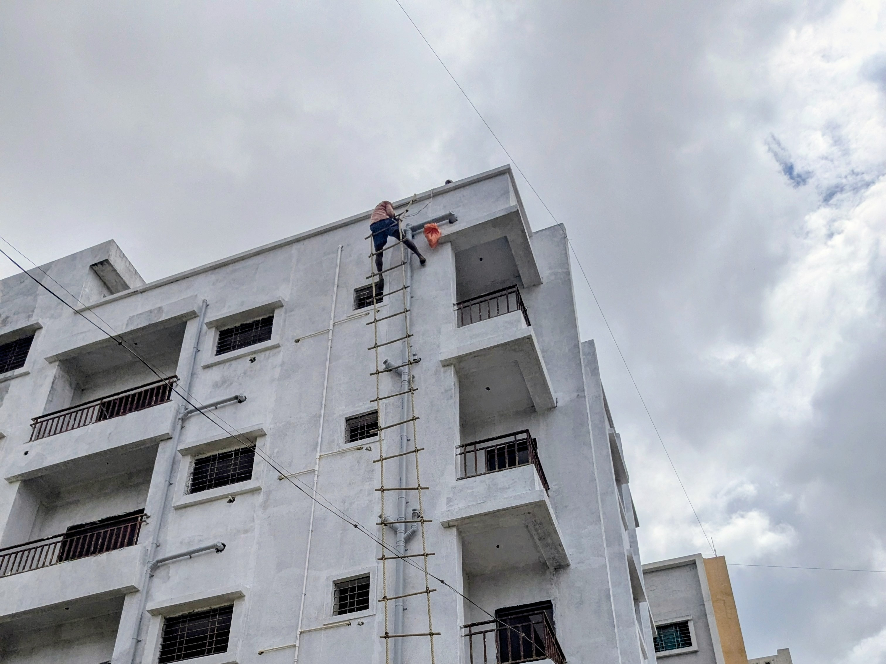
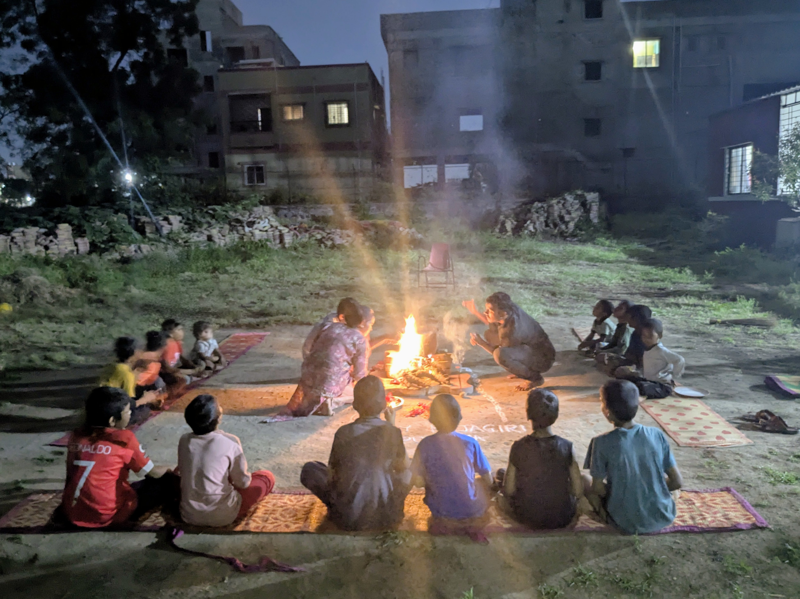
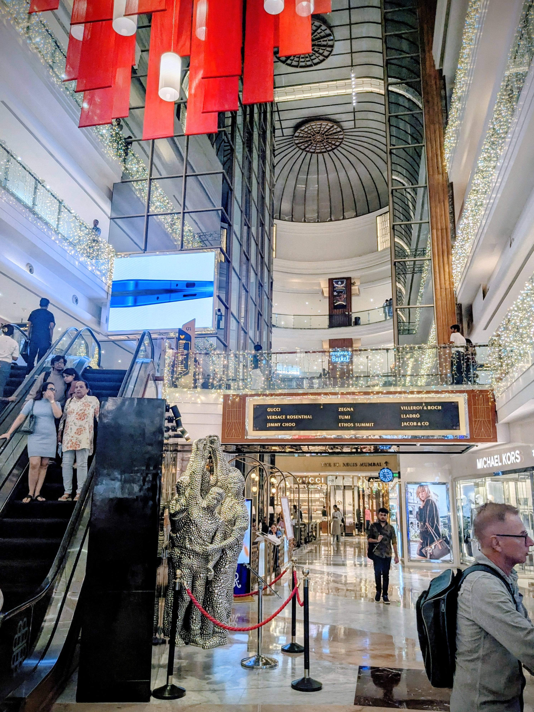
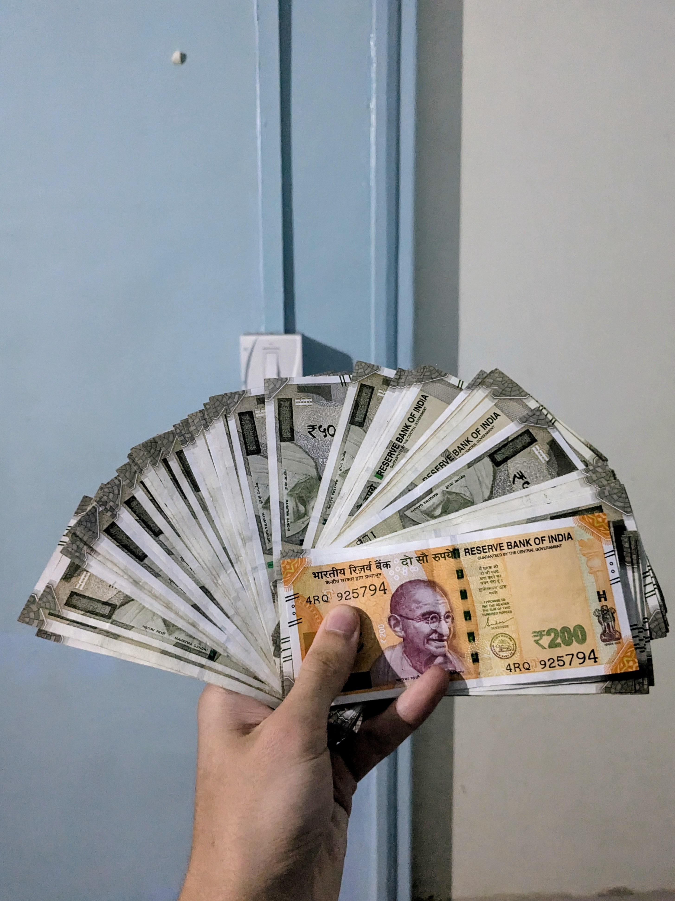
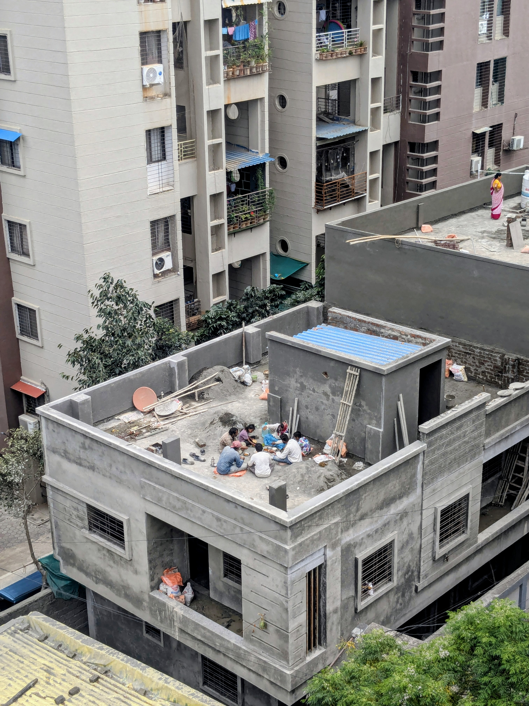
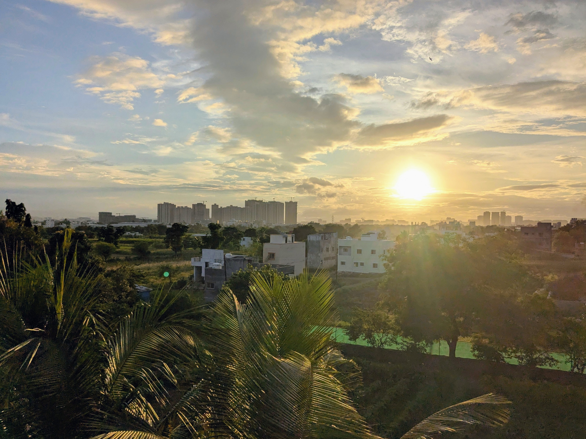
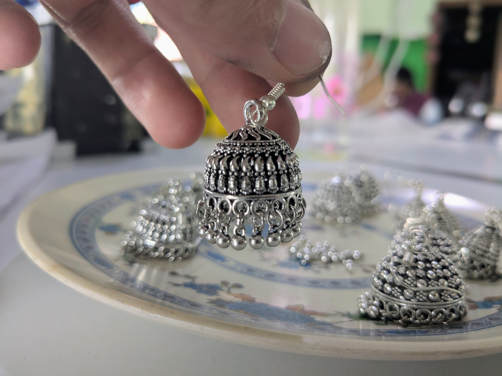
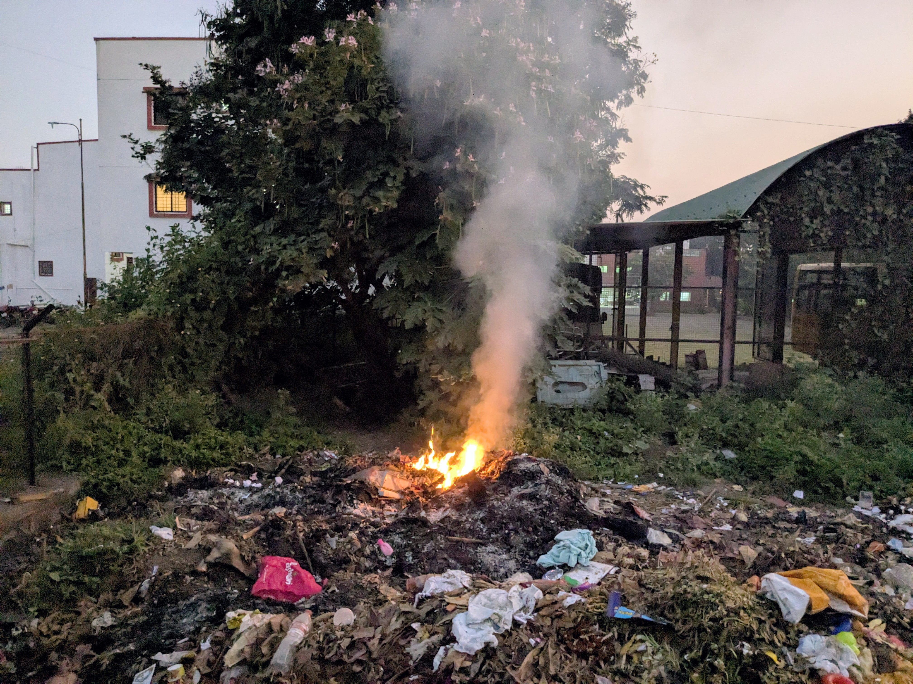
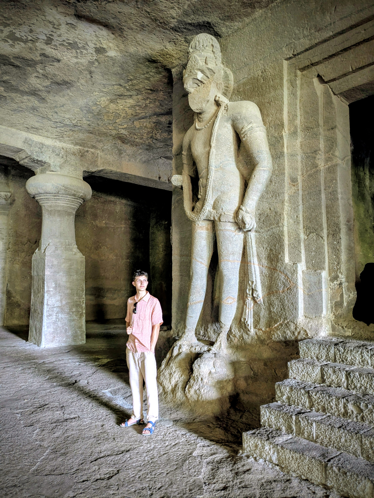

Manchmal vergesse ich fast, dass ich in Indien bin. Der Alltag hat mich eingeholt. Nach den zahllosen Festen der ersten Wochen ist plötzlich Routine eingekehrt: Vormittags arbeite ich in der Produktion, bastele Ohrringe für den Maher-Shop oder mache Aktivitäten mit den beeinträchtigten Frauen – wir werfen Bälle in Eimer, werfen Kegel um, schauen Bollywood-Filme. Nachmittags helfe ich den Kindern bei den Hausaufgaben oder spiele Fußball auf dem staubigen Feld zwischen den Häusern. 

Und mit dieser Routine passiert etwas Seltsames: Die Zeit vergeht plötzlich schneller. In den ersten Wochen fühlte sich jeder Tag endlos an. Jede Rikscha-Fahrt war ein Abenteuer, jedes Essen eine Herausforderung, jede Begegnung neu. Zwei Monate fühlten sich an wie ein halbes Jahr. Aber jetzt, da ich die Gesichter kenne, die Abläufe verstehe, die Wege auswendig kann, da beschleunigt sich alles wieder. Die Tage verschmelzen, die Wochen rasen vorbei. Es ist, als würde mein Gehirn nur noch das Neue abspeichern – und wenn nichts mehr neu ist, dann verschwindet auch die Zeit. Indien ist Alltag geworden. Und mit dem Alltag kommen die Fragen.

Heute Vormittag saß ich in der Produktion und verpackte Tee. Achtzehn Kilo in kleine Tüten, zwei Stunden lang. Neben mir eine Frau, deren Sohn in einem Maher-Center in der Stadt lebt. Sie sieht ihn dreimal im Jahr. Dreimal. Ich begegne meiner Grundschullehrerin häufiger als sie ihrem Sohn.

Nach der Schule half ich den Kindern bei den Hausaufgaben. Der achtjährige Devansh kämpft mit Mathe, und wenn er die Prüfung nicht besteht, muss er von der Englisch-Schule auf die Marathi-Schule wechseln. Was seine Zukunft verbauen würde, sagen sie hier. Englisch ist der Schlüssel zu besseren Jobs, zu mehr Möglichkeiten, zu einem Leben jenseits der Armut, in der seine Mutter aufgewachsen ist. Wir sitzen auf dem Boden, zwischen uns sein zerknittertes Matheheft. Er versteht die Aufgabe nicht, ich erkläre sie zum dritten Mal. Dann plötzlich: der Moment, in dem es klick macht. Sein Gesicht leuchtet auf. Er rechnet die nächste Aufgabe alleine – richtig.

Abends dann Kojagiri Purnima, das Vollmondfest: Wir sitzen um ein Feuer, kochen süße Reismilch, die durch das Mondlicht um Mitternacht heilende Kräfte bekommen soll. Über uns kreisen Flughunde. Das Feuer knistert. Devansh schläft auf meinem Schoß ein. Und ich, von der Situation völlig überwältigt, beginne nachzudenken.
Es sind Gedanken, die im Trubel der ersten Wochen untergingen, doch jetzt schleichen sie sich zurück in meine Realität. Wenn ich mit den Kindern spiele, sie voller Freude einem Ball hinterherrennen oder am Spielplatz turnen sehe und gleichzeitig weiß, dass jedes von ihnen eine dramatische Geschichte hat - dann drängt sich eine Frage auf, die so simpel wie unbeantwortbar ist: Warum sie und nicht ich?

Es gibt auf diese Frage keine befriedigende Antwort. Das Wieso lässt sich erklären: Ich bin in Deutschland geboren, in eine Familie mit genug Geld, genug Bildung, genug Sicherheit. Devansh ist hier in Indien geboren, seine Mutter konnte sich nicht um ihn kümmern, er landete bei Maher. Das Wieso ist Geografie, Geschichte, Zufall. Aber das Warum? Das Warum hat keine Antwort. Warum ich und nicht er? Warum meine Eltern und nicht seine? Es ist wie die Frage, warum der Himmel blau ist: Es gibt eine physikalische Erklärung, aber keine moralische.

Die Kinder hier können ihre Herkunft nicht ausblenden. Sie gehen zur Schule, sie sehen die anderen Kinder. Sie merken, dass sie weniger haben. Dass sie hier leben müssen, nicht wollen. Dass sie keine Familie haben, die für sie sorgt. Ich würde lügen, wenn ich behaupten würde, sie merkten es nicht.

Neulich war ich in einem Einkaufszentrum – gläserne Hochhäuser, internationale Marken, klimatisierte Räume. Menschen mit Apple Watches, die hier ein Vermögen kosten. Und draußen, vor der Tür, sitzen Kinder und betteln. Fünfjährige, die an Autofenster klopfen. Kinder, die auch bei Maher leben könnten. An einer Ampel kommt ein Junge zu unserem Taxi, vielleicht acht Jahre alt, barfuß, in dreckigen Kleidern. Er klopft ans Fenster, zeigt mit seinen Fingern auf seinen Mund - das Zeichen für Essen. Ich schaue weg, dann wieder hin. Die Ampel wird grün.

:::gallery

:::

Der Kontrast ist so krass, dass er wehtut. Drinnen kaufe ich für wenige Euro Kleidung, die für indische Verhältnisse teuer ist. Draußen kämpfen Menschen ums Überleben. Und ich mittendrin, mit meiner starken Währung, meinem deutschen Pass, meinem Leben voller Möglichkeiten.

Das Geld ist hier überall präsent, aber nicht als Zahl, sondern als Machtgefälle. Eine Zugfahrt kostet einen Euro – in Deutschland wären es zwanzig. Der Haarschnitt beim Friseur: anderthalb Euro. Eine komplette Mahlzeit im Restaurant: zwei Euro. Ich verdiene hier nichts, lebe von meinen Ersparnissen aus Deutschland, und bin trotzdem reicher als die meisten Menschen um mich herum. Die Sozialarbeiterin, die täglich zwölf Stunden arbeitet, verdient im Jahr, was ich in Deutschland in zwei Monaten mit meinem Minijob zum Mindestlohn verdient habe. Nicht, weil ich besser bin. Nicht, weil ich härter arbeite. Sondern weil ich das unfassbare Glück hatte, in Deutschland geboren zu werden.

Und dann wird mir etwas bewusst: Was bei uns ein Bruchteil unseres Alltags ist – ein Restaurantbesuch, ein Kinoabend, der Kaffee unterwegs – das würde hier echten Unterschied machen. Nicht abstrakt, sondern konkret. Hier bei Maher kostet es etwa fünf Euro, einem Kind eine Woche lang ein sicheres Zuhause, Essen und Bildung zu geben. Zwanzig Euro für einen Monat. Was bei uns kaum ins Gewicht fällt, verändert hier Leben. Manchmal frage ich mich, ob wir in Deutschland verstehen, welche Wirkung unsere Währung hier entfalten könnte. Nicht als Almosen, sondern als Verantwortung gegenüber einer Welt, in der Geburtsorte über Lebenschancen entscheiden.
Gleichzeitig werde ich hier privilegiert behandelt, einfach weil ich weiß bin. Die Leute wollen Fotos mit mir machen, fragen, woher ich komme, sind freundlich und hilfsbereit. Meine Hautfarbe öffnet Türen, schafft Vertrauen, weckt Interesse. Ich werde aufgrund meines Aussehens positiv bewertet – nicht obwohl ich anders aussehe, sondern genau deswegen. 

Und dann denke ich an Deutschland. An die Menschen dort, die aufgrund ihrer Hautfarbe genau das Gegenteil erleben. Die immer wieder beweisen müssen, dass sie dazugehören. Die sich anhören müssen, sie seien ein "Problem im Stadtbild". Die gleiche Hautfarbe, die mir hier unverdienten Respekt verschafft, führt dort zu unverdientem Misstrauen. Die Absurdität dieser Umkehrung zeigt, wie willkürlich Hautfarbe Menschen definiert.

Die Zeit vergeht schneller, seit sich Routine eingestellt hat. Aber mit der Routine kommt auch die Gefahr der Abstumpfung. Ich will nicht aufhören, mich zu wundern. Über die Kinder, die trotz allem lachen. Über die Frauen, die trotz ihrer Geschichten weitermachen. Über die Ungerechtigkeit, die so offensichtlich und doch so schwer zu ändern ist.

Was bleibt, ist die Frage: Wie gehe ich mit all dem um? Mit der Erkenntnis, dass mein Leben Wohl oder Übel sehr privilegiert ist? Dass ich nichts getan habe, um hier zu sein? Die Antwort können nicht Schuldgefühle sein. Ich habe nicht entschieden, in Deutschland geboren zu werden. Aber ich kann mit Verantwortung leben. Verantwortung heißt: hinschauen, nicht wegschauen. Sich der eigenen Privilegien bewusst sein. Und wo möglich, etwas zurückgeben.
Und während ich hier sitze, in meinem eigenen Zimmer, mit fließend Wasser und Strom, während draußen Kinder spielen, die nicht in ihren Familien aufwachsen können, wird mir klar: Die Ungerechtigkeit bleibt. Ich kann sie nicht auflösen, nicht für Devansh, nicht für den bettelnden Jungen am Taxi, nicht für die Frau, die ihren Sohn dreimal im Jahr sieht. Aber ich kann versuchen, verantwortungsvoll damit umzugehen.

